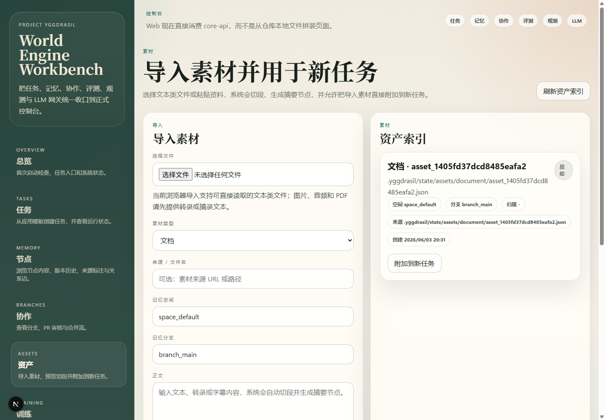
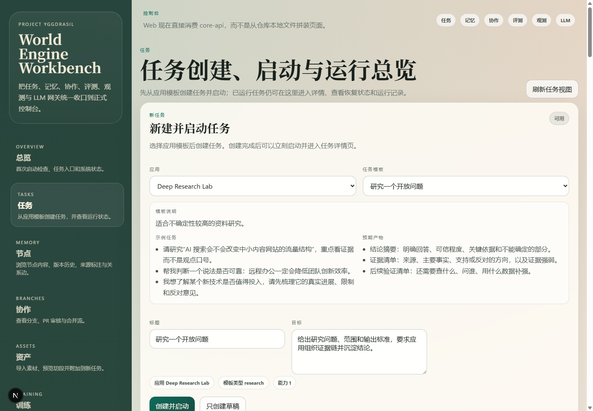
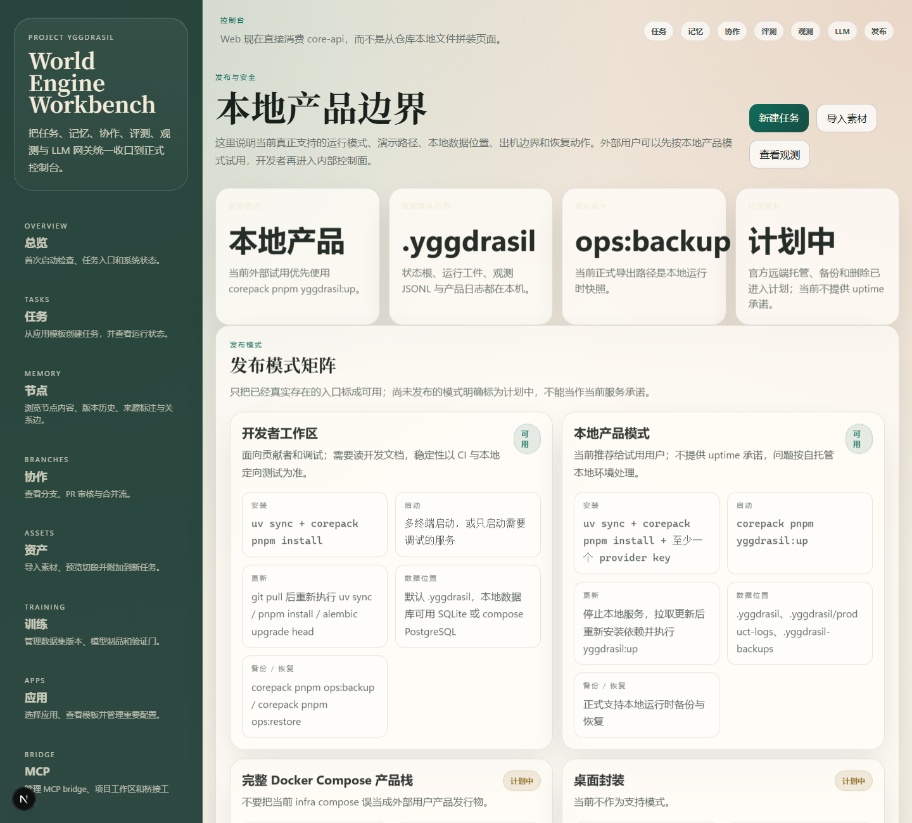

# Project Yggdrasil

[English README](README.en.md)

世界树计划的正式工程仓库。

note：部分技术验证成功，我们搭建了一个验证型应用，研究生，验证了本项目思路的可行性。见 sample 文件夹。

note2：应用包 api 和制作文档均准备完毕，见 docs\specs\application-package-interface-v0.1.md。

世界树计划是一个 Web-first 的本地长期任务系统：用户从浏览器选择应用、导入素材、创建任务并启动 Agent，CLI 主要保留给开发者和运维。

## 首次成功路径

1. 安装依赖：

```powershell
uv sync
corepack pnpm install
```

2. 基于 `.env.example` 准备 `.env`，至少配置一个模型 provider key。
3. 启动本地产品：

```powershell
corepack pnpm yggdrasil:up
```

4. 打开 `http://localhost:3000`，按首页检查项修复阻塞问题。
5. 进入 `/applications` 选择应用，或进入 `/assets` 导入文本素材。
6. 在 `/tasks` 选择任务模板，点击「创建并启动」，进入任务详情页观察运行和结果。

内置高价值入口包括 `graduate-researcher`、`deep-research`、`coding-greenfield` 和 `knowledge-studio`。这些应用现在提供场景化任务模板、示例任务和预期产物说明，适合作为第一次试用入口。

### 最短演示流程

1. 在 `/assets` 粘贴一段资料，确认页面显示切段预览、摘要节点和「用这个素材创建任务」。
2. 点击「用这个素材创建任务」，任务页会显示「已附加素材」。
3. 在应用下拉中选择 `Deep Research Lab`，确认模板显示示例任务和预期产物。
4. 点击「只创建草稿」可先得到任务编号和「立即启动」入口；点击「创建并启动」会直接进入运行队列。

完整演示脚本见 `docs/demos/LOCAL_FIRST_TASK_DEMO.md`。产品内的 `/release` 页面会说明当前支持的发布模式、本地数据位置、隐私边界、备份/恢复动作和数据治理入口。

### 产品截图







### 发布模式与支持边界

| 模式 | 当前状态 | 启动入口 | 数据位置 | 支持边界 |
|------|----------|----------|----------|----------|
| 开发者工作区 | 可用 | 手动启动服务或 `corepack pnpm yggdrasil:up` | `.yggdrasil` / compose 数据库 | 面向贡献者和调试 |
| 本地产品模式 | 推荐 | `corepack pnpm yggdrasil:up` | `.yggdrasil`、`.yggdrasil/product-logs`、`.yggdrasil-backups` | 当前外部试用默认模式 |
| 完整 Docker Compose 产品栈 | 预览可验证 | `corepack pnpm product:up` | Compose volume：`postgres-data`、`minio-data`、`yggdrasil-state`、`yggdrasil-backups` | 使用 `infra/docker-compose.product.yml`；已提供 product env、备份、恢复、快照列表、升级和回滚维护命令，正式发行前仍需多版本升级验收 |
| 桌面封装 | 未签名安装包预览 | `packaging/desktop/windows/Yggdrasil Installer.cmd` / `Yggdrasil Tray.cmd` | 同产品 Compose volume | Windows 未签名安装/卸载、托盘控制器、启动/停止/状态/日志/备份/恢复/快照/升级/回滚、更新检查和手动应用入口已提供；签名和静默自动更新未完成 |
| 托管 / SaaS | 计划中 | 尚未发布 | 计划支持官方远端工作区；当前不会自动上传 | 已进入路线图，但当前无 uptime 或商业支持承诺 |
| 官方远端数据服务 | 计划中 | 尚未发布 | 远端数据托管、远端备份、远端删除契约已冻结草案 | 当前仍只支持本地 backup/restore；契约见 `docs/specs/remote-data-service-contract-v0.1.md` |

数据治理入口位于 `/data-governance`；当前 Web 已开放备份快照、删除预览、受保护 task 硬删除、删除证明和审计，asset / node 仍只做预览。完整需求与差距见 `docs/development/PRODUCT_PACKAGING_AND_REMOTE_DATA_REQUIREMENTS_GAP_2026_06_04.md`，删除协议见 `docs/specs/data-governance-manifest-v0.1.md`，官方远端数据服务契约见 `docs/specs/remote-data-service-contract-v0.1.md`。

## 系统定位

当前仓库是一个长期任务系统，具体目标见 docs\research\系统概念：

- 后端以 FastAPI、SQLAlchemy、Alembic、Redis 为核心，承载任务运行、记忆树持久化、模块控制面和评测链路。
- 前端以 Next.js 15 + React 19 为核心，直接消费 core-api 的正式数据面，而不是扫描仓库文件。
- 模块层已经包含 text-memory、context-pruning、subagent-pr、shared-memory、pause-resume、multimodal-memory、relation-discovery、memory-organizer、training-lab 等正式实现。
- 评测层已经包含 M4-M6 回归、M8 benchmark/live、M9 acceptance，以及新增的 M9 control-plane 回归。

## 当前能力

- 正式任务执行链：任务创建、主 Agent 执行、safe-stop、pause/resume、Sub-Agent、PR 协作。
- 正式记忆链：文本导入、建树、检索扩展、共享空间、权限 tuple、多模态资产落库、关系发现、软遗忘治理。
- 正式 Prompt 管理：PromptCompiler、seed template、prompt compile artifact、模型调用请求/响应落盘、工具注册与多轮 tool execution 审计。
- 正式训练实验：dataset version、model artifact、验证门和控制面 API。
- 正式运维与评测：OpenTelemetry、Langfuse、backup/restore、compose smoke、evaluation suites。

## 基座与应用插件

- 基座继续保留 Kernel + Module + Adapter 这一内部结构，并提供通用控制面、运行时、Prompt 管理、评测与运维能力。
- 应用插件负责具体场景下的 Agent 组合、应用配置和应用界面；基座 Web 不承载面向单一场景的应用 UI。
- 当前任务、AgentRun、快照、模型调用与 Prompt 编译工件已经补上 appId 维度，为后续应用插件装配和隔离查询提供基础数据轴。

## 仓库结构

- docs/DEVELOPER_GUIDE.md：开发者手册。
- docs/USER_GUIDE.md：用户手册。
- docs/DIRECTORY_REFERENCE.md：项目完整目录与后续 agent 导航入口。
- apps/web：Web 工作台，当前已提供总览、任务、节点、协作、资产、训练、Prompt、评测、观测、发布与数据治理页面。
- services/core-api：控制面 API，当前已暴露 tasks、nodes、collaboration、runtime、memory、assets、training、prompting、evaluations、observability、data-governance。
- services/agent-runtime：运行时执行入口，负责主 Agent 启动、pause/resume、PromptCompiler 接线与模型执行闭环。
- services/module-host：模块发现、装配、注册与健康管理。
- services/worker：异步执行活动与任务消费入口。
- modules：正式模块实现。
- adapters：模型与媒体处理适配器。
- packages/python-sdk：领域对象、ORM、仓储层、运行时、PromptCompiler、评测与运维工具。
- packages/frontend-sdk：前端共享类型。
- docs：PRD、ADR、协议与数据规格。
- evaluation：正式评测样本、suite 定义与基线数据。
- infra：本地依赖基础设施、产品 Docker Compose 预览栈与观测组件。
- packaging/desktop/windows：Windows 桌面封装预览，提供未签名安装器、托盘控制器、更新检查/手动应用和产品 Compose 启动、停止、状态、日志、备份、恢复入口。

## 开源协作

- 本仓库采用 AGPL-3.0 完整开源，默认认为所有已提交的源码、文档、样例和评测材料都可以公开分发；具体边界见 `docs/OPEN_SOURCE_BOUNDARY.md`。
- 参与贡献前先阅读 `CONTRIBUTING.md`、`GOVERNANCE.md`、`SECURITY.md` 和 `CODE_OF_CONDUCT.md`。
- 涉及架构边界、公共接口、协议契约、模块生命周期或破坏性变化的重大设计调整，必须先走 `docs/rfcs/README.md` 定义的 RFC 流程。
- 英文入口文档见 `README.en.md`、`CONTRIBUTING.en.md`、`GOVERNANCE.en.md`、`SECURITY.en.md`、`CODE_OF_CONDUCT.en.md`、`docs/OPEN_SOURCE_BOUNDARY.en.md` 与 `docs/rfcs/README.en.md`。

## 本地开发

### 安装依赖

```powershell
uv sync
corepack pnpm install
```

如需本地联调，可基于 `.env.example` 准备本地 `.env`，并至少注入一个可用的模型提供方 API key；不要把真实 key 提交到仓库。

### 一键启动本地产品

```powershell
corepack pnpm yggdrasil:up
```

该命令会预检 Docker、端口、依赖和模型 provider key，启动本地 infra，执行 Alembic 迁移，再启动 Core API、Agent Runtime、Module Host、Worker 和 Web 工作台。成功后只需要打开：

```text
http://localhost:3000
```

### Docker Compose 产品栈预览

完整产品栈预览入口：

```powershell
Copy-Item infra/product.env.template infra/product.env
corepack pnpm product:compose:config
corepack pnpm product:up
corepack pnpm product:status
corepack pnpm product:smoke
corepack pnpm product:backup
corepack pnpm product:snapshots
corepack pnpm product:restore -- --snapshot <snapshot>
corepack pnpm product:upgrade
corepack pnpm product:rollback -- --snapshot <snapshot>
```

该入口使用 `infra/docker-compose.product.yml`，会构建 Core API、Agent Runtime、Module Host、Worker 和 Web 镜像，并拉起数据库、Redis、NATS、MinIO、Temporal、Jaeger 与 OTel Collector。`scripts/product-compose.mjs` 会优先读取未跟踪的 `infra/product.env`，不存在时才回退到模板。Provider key 状态会通过 `/health.providerStatus` 暴露给 Web；未就绪或 fallback 测试模式会阻止直接启动真实任务，但仍允许创建草稿。它目前是预览发行路径，适合验证自托管产品形态；正式发行前仍需完成多版本升级、回滚和冷启动演练。

### 开发者手动启动服务

需要分别调试服务时，再使用多终端手动启动：

```powershell
uv run yggdrasil-core-api
uv run yggdrasil-agent-runtime
uv run yggdrasil-module-host
uv run yggdrasil-worker --serve
corepack pnpm web:dev
```

### 本地协调后端

- 默认使用 `YGGDRASIL_COORDINATION_BACKEND=auto`，优先尝试本地 Redis，不可达时短时间熔断并回退到进程内 coordination。
- 如果通过 `corepack pnpm infra:up` 启动本地依赖，Redis 由 `infra/docker-compose.yml` 中的 `redis` 服务提供，默认监听 `127.0.0.1:6379`。
- 当前 Windows 本机也已通过 `winget install Redis.Redis` 安装 Redis on Windows，默认安装目录为 `C:\Program Files\Redis`，可执行文件包括 `redis-server.exe` 和 `redis-cli.exe`。
- 当前已验证本机 `127.0.0.1:6379` 可达，`redis-cli ping` 返回 `PONG`。
- pytest 和隔离评测环境默认切到 `YGGDRASIL_COORDINATION_BACKEND=memory`，避免把不可达 Redis 的失败等待计入本地运行时。

### 运行时热路径优化

- 应用目录、prompt registry、tool descriptors 现在都带有进程级 warm cache，减少单次运行里的重复清单扫描、hook 收集和插件加载。
- MCP bridge 的 snapshot 刷新已从请求热路径移出：配置变更和显式同步会刷新 snapshot，工具查找 miss 不再触发全量 refresh。
- builtin MCP server 默认使用 keep-alive session，避免每次请求都重新拉起 `workspace-read/edit/search/execute/python` 子进程。

### 运行时审计级别

- `packages/python-sdk/src/yggdrasil_sdk/llm_runtime.py` 现在支持 `strict`、`default`、`lean` 三档审计级别，可通过运行时请求体里的 `auditLevel` 或环境变量 `YGGDRASIL_RUNTIME_AUDIT_LEVEL` 指定。
- `strict` 保留阶段 4 之前的全量写盘行为：完整 prompt messages、完整 request transcript、完整 tool executions 和 `rawResponse` 都会同步写入工件。
- `default` 现在是推荐默认值：保留关键元数据、message digests、tool/round 摘要和 timings，去掉热路径里最重的全量 transcript 与 `rawResponse`。
- `lean` 在 `default` 基础上进一步压缩为更轻的 request/response/compiled prompt 工件，适合本地 benchmark、开发联调和无须全量审计的运行。
- `YGGDRASIL_EVAL_PRESERVE_SANDBOX=1` 会把 evaluation suite 的隔离沙箱保留到 `.yggdrasil/state/evaluation-sandboxes/`，便于事后检查 `evaluation.db`、`llm/requests`、`llm/responses`、`prompt/compiled` 和 observability 工件；与 `YGGDRASIL_RUNTIME_AUDIT_LEVEL=strict` 组合时最适合做窗口级回放与记忆设计分析。
- 当前最小测量下，`strict -> default` 将 request 工件从 `21081 B` 降到 `11435 B`，response 工件从 `1970.8 B` 降到 `1021.2 B`，compiled prompt 工件从 `13532 B` 降到 `9309 B`；`lean` 会继续把 response 工件压到约 `891.4 B`。

### 基础验证

- 运行 `uv run pytest -q` 不再强制要求本地 OTel Collector 或 Langfuse；本地 `4318` / `3100` 不可达时 observability exporter 会自动跳过。只有需要采集 traces/metrics 时，再先执行 `corepack pnpm infra:up` 或启动 `langfuse-compose.yml`。

```powershell
uv run pytest -q
corepack pnpm web:typecheck
corepack pnpm web:lint
corepack pnpm web:build
```

### 评测命令

```powershell
corepack pnpm eval:list
corepack pnpm eval:regression
corepack pnpm eval:m8:benchmark
corepack pnpm eval:m8:live
corepack pnpm eval:m9:control-plane
corepack pnpm eval:m9:acceptance
corepack pnpm eval:g2:regression
corepack pnpm eval:g4:multiscene
corepack pnpm eval:g4:web-research:default
corepack pnpm eval:g4:web-research:work-tree-long
corepack pnpm eval:g4:graduate-ml:longcat2
corepack pnpm eval:g4:graduate-ml:deepseek-v4
corepack pnpm eval:g4:provider-matrix
corepack pnpm eval:g4:provider-matrix:longform
corepack pnpm eval:g4:real-task-unrelated:dual-live
corepack pnpm eval:g4:work-tree-debug
corepack pnpm eval:work-tree:fork-runtime-harness
corepack pnpm eval:work-tree:fork-runtime-live
```

补充说明：`corepack pnpm eval:m8:live` 不是离线假跑，它会按 live suite 中的 `requestedProvider/requestedModel` 直接检查真实 provider 候选。当前默认请求 `longcat/LongCat-2.0-Preview`，并保留 `longcat/LongCat-Flash-Lite` 作为对照 case；如果未配置 `YGGDRASIL_LLM_API_KEY_LONGCAT` 或 `LONGCAT_API_KEY`，suite 会在调用前失败，并且不会产生任何供应商侧调用记录。

`corepack pnpm eval:g4:multiscene` 目前沿用历史命名，但根脚本已经切到默认 Web Research 真实任务 suite；`corepack pnpm eval:g4:web-research:default` 是同一 suite 的显式入口，聚焦网络检索、多源对比和矛盾处理。`corepack pnpm eval:g4:web-research:work-tree-long` 是 Web Research 长任务入口，用于观察多窗口 continuation 与工作树连续性。

`corepack pnpm eval:g4:provider-matrix:longform` 是单任务长样本入口：它暂时只聚焦一个更长的 coding-greenfield 任务，并在 `deepseek_direct / deepseek-v4-pro` 与 `longcat / LongCat-2.0-Preview` 上复跑，用于观察更高任务长度下的首响、完成质量与返工口径。

`corepack pnpm eval:g4:graduate-ml:longcat2` 与 `corepack pnpm eval:g4:graduate-ml:deepseek-v4` 是 Graduate Researcher 应用的机器学习研究生 live 入口，重点检查 tool-rich 学习过程、预算、证据、阶段汇报和人工评审占位。`corepack pnpm eval:g4:provider-matrix` 是 Gate 4 live provider matrix，`corepack pnpm eval:g4:real-task-unrelated:dual-live` 用与本项目无关的 incident RCA 题面对照 LongCat 与 DeepSeek，`corepack pnpm eval:g4:work-tree-debug` 是显式工作树调试 harness。

`corepack pnpm eval:work-tree:fork-runtime-harness` 是工作树图 Fork Batch 6 deterministic runtime harness，会通过真实 worker 消费 fork work item 并验证 AgentRun、prompt artifact、workTreeSnapshot 和 pending summary-only 信息流。`corepack pnpm eval:work-tree:fork-runtime-live` 是手动 live 候选入口；必须先设置 `YGGDRASIL_FORK_RUNTIME_LIVE=1` 并配置 provider key，否则会记录为 blocked 而不是误报通过。开启 live 后，suite 会关闭模型 fallback，要求 `longcat / LongCat-2.0-Preview` 真实 invocation、prompt compile artifact 和 live invocation evidence 与 runtime completed 终态达标；2026-06-25 已通过 `evalrun_69093187bf6c46e587c3`。该入口是 live smoke，不是长任务证据。

历史窗口 stress 与真实任务 parity suite 文件仍保留在 `evaluation/suites/` 作为专项资产，但当前根 `package.json` 不再暴露对应 `pnpm` 脚本。若恢复这些入口，必须同时更新 `package.json`、README 和 `docs/DIRECTORY_REFERENCE.md`。

如果要在 live suite 或 `pilot-live` 中使用付费 provider（例如 `deepseek_direct / deepseek-v4-pro`），除了配置 API key 之外，还必须显式设置 `YGGDRASIL_ALLOW_PAID_MODELS=1`；否则 paid candidate 不会进入 runtime catalog。

### 运维命令

```powershell
corepack pnpm infra:up
corepack pnpm infra:down
corepack pnpm infra:smoke
corepack pnpm yggdrasil:up
corepack pnpm ops:backup
corepack pnpm ops:restore
corepack pnpm real-user:prepare
corepack pnpm real-user:scorecard --csv .\evaluation\fixtures\real-user-validation\scorecard-2026-05-15-g2-complete.csv
```

### 真实用户试跑准备

`corepack pnpm real-user:prepare` 会在仓库外同级目录生成一个专用试跑沙箱，包含工作区快照、隔离 `.yggdrasil` 状态目录、冻结任务材料副本与激活脚本，避免内部试跑回写当前工程仓库。

命令行入口与服务启动入口现在会自动加载仓库根 `.env`。本地开发若使用 `YGGDRASIL_STATE_ROOT`，它应指向状态根目录本身（例如 `.yggdrasil`），而不是 `.yggdrasil/state`，否则运行时会再追加一层 `state/`。

### 真实用户试跑前提

- 当前 Windows 主机若默认 `9000/9001` 被占用，启动 infra 前先覆盖 MinIO 端口：`YGGDRASIL_MINIO_API_PORT=19000`、`YGGDRASIL_MINIO_CONSOLE_PORT=19001`。
- 真实试跑必须先执行 `corepack pnpm real-user:prepare`，再进入生成的专用沙箱并使用激活脚本；不要直接对当前工程仓库运行试跑任务。
- 试跑环境至少要保证 `YGGDRASIL_GIT_REPO_PATH`、`YGGDRASIL_MCP_PROJECT_WORKSPACE`、`YGGDRASIL_STATE_ROOT` 都指向沙箱。仅切换状态目录并不够，内置 MCP 仍可能回写真实仓库。
- 首轮内部试跑的交付物至少包括评分表、录屏、trace 与任务工件目录。

## 规格入口

- docs/PRD-v0.1.md
- docs/protocols/README.md
- docs/specs/README.md
- docs/specs/agent-runtime-protocol-v0.1.md

## 当前重点

当前阶段的重点已经切换为“在维持 Gate 4 正式基线不回退的前提下，把‘记忆树为主体、上下文窗口为工作集’的伪无限上下文窗口实现提升为当前第一优先级”。

### 阶段状态（2026-05-16）

- Gate 1 已闭合：在 `deepseek_direct` / `deepseek-v4-pro` 下完成 `YGG-CI-01`、`YGG-CG-01`、`YGG-CG-03` 官方复跑，3 张任务卡全部验收通过。
- Gate 2 已闭合：完成 1 轮全量官方复跑 + 2 轮稳定性复跑；`YGG-CG-01` / `YGG-CG-03` 连续 3 轮全部通过，人工接管中位数 0，用户澄清回合中位数 0，恢复成功率 100%。
- Gate 3 已闭合：首 token 观测、work tree 正式对象、post-invocation budget hard fail、`execute_server` 默认拒绝网络命令、worker retry/requeue 与 paid-provider live batch 已全部落下正式证据。
- Gate 4 已闭合：few-shot 执行链、官方三场景资产收口、`evalsuite_g4_multiscene`、`evalsuite_g4_provider_matrix`、Prompt 控制面 few-shot 显示与手动 release gate 已完成闭环。
- 伪无限上下文窗口第一版已落地并取得首轮 live 证据：execution loop restart controller、restart snapshot、carry-forward package、runtimeMetrics 与窗口重启 stress 评测资产已落地；LongCat 与 DeepSeek 已作为正式 stress provider 批准，并在 `evalrun_1160dc08b84e4b6e8268` 中完成 `restartCount=100` 的正式复跑。
- LongCat 真实任务结构性对照已补上：`evalsuite_g4_real_task_window_parity` 在 `evalrun_590eca26a63247308373` 中完成 `64k` vs `128k` 的 4M 级样本对照；但保留日志重跑 `evalrun_941c8b8ca2204966812d` 已确认，这条证据目前只证明 restart 技术闭环，尚未证明最终交付 parity。
- 当前正式闭环证据应分开看：Gate 2/3/4 基线闭环参考见 `docs/research/g2-closeout-2026-05-15.md`、`docs/research/g3-closeout-2026-05-15.md`、`docs/research/g4-closeout-2026-05-15.md`；真实任务 parity 的最新修正结论见 `docs/research/g4-real-task-window-parity-rerun-log-audit-2026-05-16.md`。

下一步更值得投入的是：

- 先修正恢复态 prompt contract、记忆树/工作树恢复语义，以及“release brief 已完成、parity judgment 已给出”的强验收口径。
- 在上述修正完成后，再在 DeepSeek 上补齐同一条真实任务的 `64k` vs `128k` 对照，确认多 provider 下的 parity 结论是否稳定。
- 基于 stress + real-task 两条 live 证据，重新冻结 `restartCount`、`cumulativeWindowSpanTokens`、`restartSuccessRate0_1`、`goalCompletionParity0_1`、`deliveryEquivalence0_1` 与 `qualityDeltaToLongWindow0_100` 的正式门槛。
- 在上述主线完成前，只维持必要的 G4 provider matrix 样本补录与最小非阻塞技术债清理，避免被次要事项分散。
- 相关研究入口见 `docs/research/pseudo-infinite-context-window-roadmap-2026-05-16.md`、`docs/research/g4-long-task-window-restart-baseline-2026-05-15.md` 与 `docs/research/g4-real-task-window-parity-rerun-log-audit-2026-05-16.md`。

