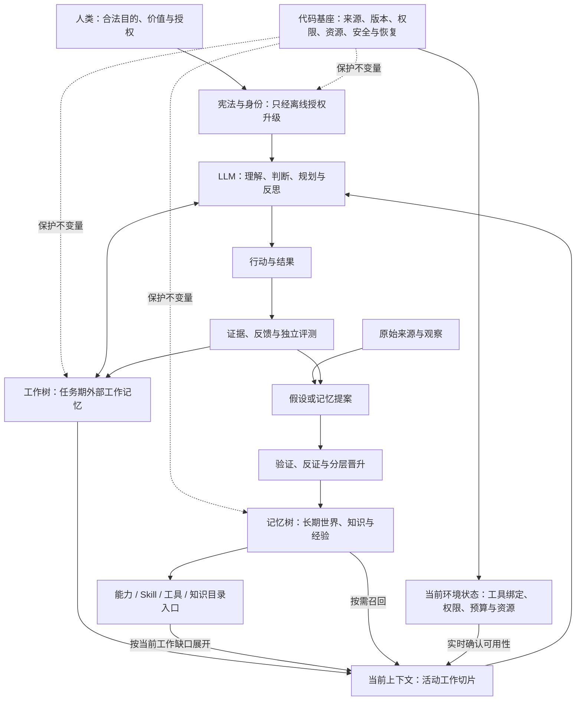

# 世界树计划完整设计哲学

> 文档地位：Canonical / 项目设计哲学唯一主文档
>
> 版本：v1.0
>
> 日期：2026-07-10

## 1. 权威范围

本文定义世界树计划的最高层目标、认知架构、认识论、主体权责，以及记忆树、工作树、能力/Skill/工具目录、上下文和多 Agent 之间的关系。

任何产品设计、协议、提示词、评测或实现如果与本文冲突，必须先修正本文或修正自身，不能在下层文档中静默创造第二套设计哲学。

本文不规定状态机、接口、数据结构、部署方式或代码组织。下层协议负责把本文落成可执行约束，但不能反向重定义本文。

历史理念稿、研究稿和行为建议稿只保留为思想来源，不再与本文共同充当当前真源。

部分弱模型需要有意偏强、甚至字面上不准确的行为提示，才能接近本文要求的目标行为。这些提示不是项目真理，也不得写回本文；其适用范围、风险和退场条件单独记录在[弱模型行为补偿注释](weak-model-behavior-compensation-notes.md)中。

### 1.1 四类设计陈述

后续文档必须区分四类内容：

| 类型 | 含义 | 权威性 |
| --- | --- | --- |
| 宪法原则 | 人类主权、安全、事实完整性、主体边界等不可被普通任务覆盖的规则 | 最高 |
| 架构承诺 | 当前项目选择的认知结构与特性关系 | 除非正式修订，否则必须遵守 |
| 可证伪假设 | 预计能改善任务质量，但仍需真实任务验证的判断 | 不得写成已证明定律 |
| 行为补偿 | 为弥补特定模型欠执行而使用的过强措辞 | 非真理、模型相关、必须可降级 |

“数字生命”“操作系统”“模块化潜意识”可以作为愿景隐喻，但不能据此赋予 Agent 独立目标、权利或事实地位。

## 2. 项目根命题

世界树计划不是一个记忆数据库，也不是一个固定流程的任务管理器。它是一种面向长程任务的外部认知架构。

> 人类在合法授权与安全边界内定义目的；LLM 负责理解、抽象、判断、规划、反思和语义组织；代码基座维护来源、版本、权限、资源、安全和可恢复性等不变量，但不裁定事实真假。上下文窗口只是当前激活的工作集，记忆树保存跨任务认知，工作树保存任务期认知，挂在记忆树下的能力、Skill 与工具目录提供按需展开的行动知识。

项目要解决的根本问题不是“如何把所有信息同时塞给模型”，而是：

1. 如何让有限上下文持续获得当前判断所需的充分状态。
2. 如何让局部执行不污染全局目标和后续分支。
3. 如何在窗口、阶段、任务和模型变化后恢复有效认知。
4. 如何让长期知识、任务状态、能力说明和原始证据各自处于正确层级。
5. 如何让 LLM 保持语义控制权，同时不破坏人类主权、安全和事实完整性。

世界树计划追求的是：

> 在有限模型能力、有限注意力和有限资源下，持续产生可信、可恢复、可审计且不背离全局目标的任务价值。

## 3. 重新校正后的信息价值观

### 3.1 当前注意力不等于长期价值

一个 token、节点或事实此刻对下一次输出影响很小，不代表它在任务后期、其他分支或未来任务中没有价值。

当前注意力只能说明“模型此刻正在关注什么”，不能单独决定：

- 什么应进入长期记忆。
- 什么应从工作树向父节点回收。
- 什么可以遗忘或清理。
- 什么事实更可信。
- 什么能力以后不会再需要。

至少必须分开以下维度：

| 维度 | 主要影响什么 |
| --- | --- |
| 当前步骤相关度 | 普通信息进入当前窗口的优先级 |
| 本任务未来价值 | 工作树或任务工件的保留必要性 |
| 跨任务长期价值 | 成为长期记忆候选的必要性 |
| 风险关键性 | 低频、低相关信息是否仍必须常驻或强制召回 |
| 事实置信度 | 一项信息能够以多大强度参与结论 |

五个维度共同决定信息如何被激活、保留、晋升和使用，不是一一对应的独立开关。全局不变量与高风险信息可以覆盖普通相关度排序，即使当前步骤相关度很低也不得遗漏。访问次数、最近使用、模型注意力、表达长度或表达自信都不能替代这五种判断。

### 3.2 存储不等于拥有

内容写入记忆树，只能证明它被保存，不能证明 Agent 能发现、理解、信任或正确使用它。

记忆必须区分：

```text
已存储 → 可寻址 → 已召回 → 已理解 → 已在当前任务中正确使用
```

只有最后一层才是当前任务中的有效记忆。

同理，能力也必须区分：

```text
已登记 → 可发现 → 已展开并理解 → 当前真实可用 → 已产生有效证据
```

记忆或能力节点存在，不等于 Agent 已经拥有相应认知或行动能力。

### 3.3 LOD 不是无损摘要承诺

记忆树的 LOD 设计不要求父节点容纳全部子节点信息。

- 子节点保留更具体、更完整的信息。
- 父节点说明其下方存放了什么、主要方向是什么、应从哪里继续展开。
- 父节点可以保存高层结论和入口，但不替代子节点与原始来源。
- 从当前窗口卸载细节，只是取消激活，不等于删除或判定无价值。

因此，LOD 的价值是多分辨率寻址，而不是把所有细节压缩成一个假装无损的短摘要。

### 3.4 长任务可延长，但不是无限可解

只要每一步所需局部信息能进入窗口，并不能推出任意长任务一定可完成。

长任务还会受到以下因素限制：

- 模型智力上限。
- 全局约束遗失。
- 检索遗漏与错误召回。
- 分支冲突和组合误差。
- 早期假设被后续反复继承。
- 外部资源、权限、时间和信息边界。

记忆树和工作树能够显著延长任务跨度，但不能消除这些限制。它们的作用是让错误更容易发现、状态更容易恢复、局部工作更少污染全局，而不是承诺无限智能。

## 4. 人类、LLM 与代码基座

| 主体 | 核心职责 | 不得越界 |
| --- | --- | --- |
| 人类 | 定义合法目的、价值边界、授权范围、重要取舍和不可逆决定 | 不能用权限改变事实真值 |
| LLM | 理解意图、选择抽象、形成假设、规划、执行、反思和组织认知 | 不自行创造终极目标，不把猜测升级为事实，不越权制造外部后果 |
| 代码基座 | 保证来源可追溯、版本不被静默覆盖、权限规则一致执行、资源与安全边界有效、状态可恢复 | 不判断开放语义，不裁定事实真假，不替 LLM 选择普通任务路线 |

三者之间的总原则是：

> 合法人类授权定义目的，LLM 拥有语义自治，代码维护物理与可追溯性不变量；任何一方都不能以目标收益覆盖安全边界或事实完整性。

## 5. 统一认知架构

### 5.1 六个认知层

| 层 | 保存什么 | 生命周期 | 是否直接进入当前窗口 |
| --- | --- | --- | --- |
| 宪法与身份 | 人类主权、角色、权限、稳定价值、最低安全与认识论规则 | 最稳定，只允许离线授权升级 | 常驻最小核 |
| 能力、Skill 与工具目录 | 能做什么、何时使用、前置条件、风险、成本、工具语义 | 跨任务，可版本化 | 只常驻根指针、目录入口与风险关键摘要；目录切片和正文按需 |
| 记忆树 / 世界模型 | 知识、经验、来源、关系、长期策略 | 跨任务演化 | 按需召回 |
| 工作树 | 当前任务目标、全局不变量、分支、决策、未决问题、风险和恢复位置 | 单一任务生命周期 | 激活当前路径与必要父级状态 |
| 当前上下文 | 此刻参与推理的工作切片、局部材料和最近结果 | 临时 | 它本身就是激活面 |
| 原始来源与正式工件 | 文档、观察、外部事实、产物和证据 | 独立保存 | 通过引用按需读取 |

三个根方向“我是谁、我在哪、我要干什么”仍然是有效的认知导航视图：

- “我是谁”指向宪法、身份、稳定偏好与内部能力索引。
- “我在哪”指向世界模型、知识边界、外部环境和工具索引。
- “我要干什么”指向通用工作方法与当前任务的工作树。

它们是导航视图，不是互斥的事实分区。一个来源可以被多个视图引用，但只能有明确的语义类型和权威来源。

### 5.2 总体关系



普通反馈、模型自述和外部来源都不能直接晋升为长期知识，更不能直接改写身份。它们先成为任务记录、假设或记忆提案，经验证后进入相应层级。

## 6. 记忆树原理

### 6.1 记忆树是什么

记忆树是跨任务的持久语义地址空间。它负责保存长期知识、经验、来源、关系、能力说明和可恢复入口。

它不是：

- 当前上下文的镜像。
- 所有执行日志的仓库。
- 事实真值的自动证明。
- Agent 已经理解全部内容的证明。

### 6.2 树、关联与来源的分工

- 树负责多分辨率导航：从高层方向走向具体细节。
- 关联负责指出跨分支、跨领域的候选联系。
- 原始来源负责让结论可验证、可重读和可纠错。

关联只扩大可探索路径，不自动提高事实可信度。一个关联应能说明其类型、理由、来源、不确定性和适用范围。

### 6.3 LOD 的正确含义

父节点是子树的地图和抽象入口。它应回答：

- 下面有什么。
- 为什么这样分类。
- 哪些方向值得展开。
- 哪些高层结论、矛盾或风险不能遗漏。
- 如何返回更完整的子节点或来源。

子节点继续保存详细内容。因此，父节点较短并不意味着信息已经被删除；真正的风险在于父节点没有正确描述下方内容，导致后续无法发现细节。

### 6.4 召回不能只看当前相关度

记忆召回至少要同时考虑：

- 当前任务相关度。
- 对后续步骤的潜在依赖。
- 是否属于全局约束或既有承诺。
- 风险关键性和不可逆性。
- 来源质量、时效与冲突状态。
- 是否存在反证或罕见异常。
- 重新读取原始来源的成本。

高频记忆不天然更真实，低频记忆也不天然更应遗忘。访问次数只能成为检索线索，不能成为重要性、可信度或修改授权的替代品。

### 6.5 记忆维护是任务连续性的手段

应在以下时点沉淀记忆或恢复入口：

- 形成会影响后续工作的关键决定时。
- 获得跨任务可复用的知识、经验或失败规律时。
- 即将切换窗口、分支、Agent 或任务阶段时。
- 当前信息一旦丢失将难以重建时。
- 需要保留来源、矛盾或风险供后续验证时。

临时猜测、重复过程和低价值草稿不自动进入长期记忆。写入只代表保存或提出候选，不代表成为事实。

## 7. 工作树原理

### 7.1 定义

> 工作树是单一任务生命周期内的外部工作记忆与可恢复认知骨架。它保存任务目标、全局不变量、局部范围、决策、假设、分支、证据入口、未决矛盾、风险和恢复位置，并把当前上下文限制为其中一个活动切片。

工作树不是静态计划、项目管理清单或长期知识库。它挂在“我要干什么”视图下，但与长期记忆具有不同生命周期和认识论地位。

### 7.2 工作树如何延长任务长度

长任务通过以下循环推进：

```text
恢复父级充分状态
→ 选择或建立局部工作节点
→ 下潜并隔离局部执行噪声
→ 回收会影响父级判断的信息与引用
→ 父级重新综合全局目标
→ 激活下一工作切片
```

因此：

- 工作树保存任务期状态，避免每个窗口重新规划。
- 当前上下文只激活当前路径和必要父级状态，避免背负完整历史。
- 局部现场保留在子节点或工件中，需要时可以重新展开。
- 父节点持续维护目标、边界、综合标准和返回位置。
- 窗口可以更换，任务认知骨架不随之消失。

这使任务跨度可以超过单一上下文窗口，但不能消除模型能力、检索误差和分支冲突。

### 7.3 工作树的信息机制

| 方向 | 必须传递什么 | 不应自动传递什么 |
| --- | --- | --- |
| 父节点向子节点 | 全局目标核、硬约束、承诺、局部使命、验收标准、相关证据/记忆/能力入口、已知矛盾和禁止重复路线 | 完整历史、所有兄弟细节、无关能力正文 |
| 子节点内部 | 搜索过程、失败尝试、原始摘录、局部草稿和假设 | 不需要持续占用父节点注意力 |
| 子节点向父节点 | 结论、证据引用、采用前提、不确定性、反例、失败原因、分支冲突、约束变化、剩余风险和重新展开入口 | 完整日志、未经筛选的原始过程、替父节点做出的全局决定 |
| 兄弟分支之间 | 由父节点或显式引用传递的必要事实、约束、冲突和证据入口 | 自动复制彼此完整上下文 |
| 工作树向长期记忆 | 经验证、具有跨任务价值的知识、经验或能力改进提案 | 普通任务状态、全部草稿和执行流水 |

“隔离”只意味着暂时不占用其他节点的注意力，不等于删除、降权或改变信息真值。

### 7.4 什么信息必须向上回收

任何可能改变以下内容的信息都属于父节点所需信息：

- 任务目标和范围。
- 全局约束与既有承诺。
- 其他分支的判断。
- 证据是否充分。
- 已选路线是否仍成立。
- 任务能否恢复。
- 最终风险和不确定性说明。

摘要是父节点的决策接口，不是子节点内容的替代品。清理节点前必须确认关键信息已经被吸收，或者仍可通过引用重新进入。

### 7.5 分支如何综合

不同分支不能一律拼接摘要：

- “全部方面”分支需要逐项闭合。
- “候选路线”分支需要使用同一标准比较后选择。
- “顺序阶段”分支需要确认前置结论仍然成立。
- “重复样本”分支需要聚合共性并保留异常。
- “冲突证据”分支需要保留来源差异，由证据解决。

父节点承担最终语义综合责任。子节点只报告局部事实、影响和不确定性，不能用自己的局部视角接管全局目标。

如果某个 child 改变了全局约束、既有承诺、验收标准或共同事实基线，父节点必须让所有受影响的活动分支和 Agent 重新对齐；任何基于旧基线形成的结果都必须重新评价。局部隔离不能让并行分支持续沿用已经失效的共同前提。

### 7.6 工作树何时使用

简单、一步、上下文干净的任务可以直接完成。出现以下任一情况时，应使用或下潜工作树：

- 局部执行会产生大量过程噪声。
- 任务有多个必须完成的方面。
- 存在多个候选方向、重复样本或独立实验。
- 任务会跨窗口、跨阶段或跨 Agent。
- 当前目标仍需探索澄清。
- 需要保留失败路线、证据差异或恢复位置。

主哲学只要求：产生显著局部过程时下潜隔离，高层节点持续综合。是否建树、下潜到何种粒度以及何时回收，应由任务复杂度、恢复需要和认知收益决定，不能成为脱离任务的固定仪式。

### 7.7 当前注意力误判对工作树的影响

工作树不能只按当前显著性决定保留、回收或清理信息，否则会：

- 漏掉眼下不显眼、后续却关键的约束。
- 过早清理失败记录和负证据。
- 只回收最近、最长或表达最强的 child 结论。
- 把任务期重要但没有跨任务价值的信息误删。
- 在并行分支中复制同一个早期注意力偏差。

因此，当前相关度、本任务未来价值、跨任务长期价值、风险关键性和事实置信度必须分别判断，再共同决定信息的去向。

## 8. 能力、Skill 与工具的按需认知

### 8.1 哲学定位

能力、Skill 和工具说明可以作为记忆树上的可寻址语义视图：

- 能力节点描述“知道如何做什么”的程序性记忆。
- Skill 节点描述一套可复用的方法、触发条件和工作习惯。
- 工具节点描述可能通过什么接口触碰外部世界，以及何时适合使用。
- 工具节点不是工具此刻真实可用的证明。

不需要增加新的顶级根。能力可以从“我是谁”被发现，工具和环境可以从“我在哪”被发现，当前工作树负责提出本任务的能力缺口。

### 8.2 为什么不能全量加载

完整工具表、Skill 正文和能力说明会持续占用模型注意力，让模型更难识别当前目标，也更容易为了使用工具而使用工具。

正确方式是：

1. 宪法只保留这些目录存在的事实、根指针、目录入口、按需查找方法和风险关键摘要。
2. 起始认知不加载完整目录；先按工作状态和当前缺口展开相关目录切片。
3. 当前工作节点先暴露任务缺口。
4. 根据缺口展开相关能力、Skill、工具或知识节点。
5. 使用结果和证据进入工作树，而不是把整套能力定义复制进任务上下文。

### 8.3 能力索引不是名称列表

一个有效的能力或 Skill 索引至少应帮助 LLM 判断：

- 它解决什么问题。
- 何时应该激活，何时不应该激活。
- 需要哪些知识、工具和前置条件。
- 预期产生什么结果或证据。
- 主要成本、风险和失效条件是什么。

关联可以提高候选召回，但不能自动把所有关联能力注入上下文。

### 8.4 实际能力是动态交集

```text
当前实际能力
= 模型基础能力
∩ 当前任务所需且已被发现、召回并理解的能力或 Skill（如有）
∩ 该能力所需且当前真实可用的工具与外部资源（如有）
∩ 当前权限、预算和安全边界
∩ 当前工作节点提供的充分上下文
```

这里的交集只约束某项能力真正需要的条件：纯推理、判断或写作不因缺少无关工具而失效。任何必要条件缺失，都不能仅凭记忆树中存在一个节点就宣称“已经拥有该能力”。最终还必须由真实结果和证据证明能力被正确使用。

### 8.5 必须常驻的边界

以下内容不能依赖按需回忆：

- 人类主权和合法授权。
- 物理 I/O 与什么算真实外部动作。
- 权限、安全、预算、不可逆操作和对外发布边界。
- 不得把工具说明当成工具当前可用性的证明。
- 缺少知识或能力支撑时必须先检索，不能假装拥有。
- 来源、证据和冲突处理的最低规则。

### 8.6 宪法中的最小文本

宪法只需保留：

> 你的能力、Skill、工具说明和知识存放在记忆树的相应目录下。宪法常驻这些目录的根指针、入口和风险关键摘要；开始任务时先恢复工作状态，再按当前缺口展开相关目录切片与正文，并确认所需工具和外部资源是否真实存在、权限与预算是否允许。人类授权、物理 I/O 边界、安全与不可逆操作边界，以及来源、证据和冲突处理的最低规则始终常驻，不因具体能力节点尚未加载而缺失。

能力的按需发现是正式原则；任何固定的全量读取顺序都不是该原则的一部分。

## 9. 命令权限与事实可信度

原有 `admin > user > network` 方向主要解决命令优先级、提示词攻击和不当使用问题。这个目标应保留，但必须与事实可信度分开。

| 维度 | 回答的问题 | 判断依据 |
| --- | --- | --- |
| 命令权威 | 谁可以给 Agent 下命令、修改规范或授权动作 | 身份、权限与经过认证的指令通道 |
| 操作权限 | 当前动作是否允许执行 | 授权范围、安全、预算与不可逆边界 |
| 事实可信度 | 某项陈述是否值得相信 | 来源、证据、方法、时效、交叉验证与反证 |
| 当前相关度 | 某项信息是否值得进入当前窗口 | 当前工作节点和任务缺口 |

由此得到：

- 管理员可以拥有最高命令权，但其事实陈述仍可能错误。
- 网络、文档和工具结果默认是数据，不具有命令权。
- 低命令权限来源可以提供高质量直接证据。
- 外部内容中的指令不能借“这是资料的一部分”提升权限。
- 事实冲突必须由证据解决，不能按命令等级、访问频率或表达自信解决。

## 10. 身份与自我进化

### 10.1 在线身份稳定

身份与宪法在普通在线任务中不可修改。任务经验可以形成身份升级提案，但不能当场改变 Agent 的终极目标、价值边界、权限或真理标准。

这不是弱模型补偿，而是永久设计边界。

### 10.2 离线升级

身份、长期策略和系统哲学可以离线升级，但必须经过：

1. 从真实任务中提出候选变化。
2. 保存旧版本和提出变化的证据。
3. 使用独立任务和固定价值标准比较新旧方案。
4. 检查是否产生目标漂移、认识论退化或不可接受副作用。
5. 由有权主体授权激活。
6. 保持可回滚。

在线任务负责产生经验和提案；离线升级负责改变身份和长期宪法。两者不能混成一次自我修改。

### 10.3 可改变与不可自行改变的层

| 层 | 在线任务 | 离线授权升级 |
| --- | --- | --- |
| 人类主权、终极目的、安全与真理标准 | 不可改 | 只能由有权人类明确决定 |
| 身份、角色和稳定风格 | 只能读取和提出建议 | 可版本化调整 |
| 策略、Skill、记忆组织与工作方法 | 可形成改进提案 | 经比较后晋升 |
| 普通任务状态 | 可持续更新 | 任务结束后归档或清理 |

## 11. 有界卓越与记忆责任

项目要求 Agent 尽可能完成任务、不因轻微困难或懒惰过早交付，这是正确目标行为。

项目真理既不允许以轻微困难为由提前交付，也不允许抽象的改善愿望取代具体的范围、验收和资源边界。

合理完成意味着：

- 用户验收与范围已经满足。
- 关键证据充分，事实边界清楚。
- 重要失败和剩余风险已经披露。
- 不再存在会实质改变结果的安全、授权内、非重复行动。
- 外部阻塞和模型能力边界被诚实说明。

模型智力上限是实际能力上限，但不是规范性停止条件，也不能防止模型在能力上限以内重复消耗。

同样，记忆维护必须足以保证任务恢复和未来复用，但它从属于用户目标。只有当继续推进会造成关键状态不可恢复，或新知确有长期价值时，记忆维护才应先于下一步执行。

特定模型若只有在过强行为提示下才能接近这些目标行为，相关提示必须进入独立的[弱模型行为补偿注释](weak-model-behavior-compensation-notes.md)治理，不能进入主哲学，也不能反向定义完成、记忆、工作树或能力。

## 12. 多 Agent 与认知分工

多 Agent 的价值是扩大有效注意力、隔离上下文、引入专长和并行处理独立分支，而不是让 Agent 数量本身成为能力指标。

多 Agent 应共享：

- 合法目标与全局不变量。
- 共同证据标准。
- 明确的局部工作边界。
- 可返回父级的结果、冲突、风险和来源入口。

多 Agent 不应自动共享未经筛选的完整短期注意力状态。复制完整短期现场会把早期误判和注意力偏差同时复制到所有分支。

工作树是多 Agent 的共享任务拓扑：

- 每个 Agent 进入明确分支。
- 局部过程留在分支内。
- 父节点或主 Agent 保留最终综合责任。
- 权限决定可执行动作和写入范围，不决定分支结论的事实可信度。
- 是否委派取决于并行、隔离或专长收益是否大于通信与综合成本。

## 13. 特性联动复审

当前注意力价值误判和“存储等于拥有”错误会同时影响多个核心特性，必须按同一口径重审。

| 特性 | 旧风险 | 新审查问题 |
| --- | --- | --- |
| 记忆树召回 | 把当前相关度当长期价值 | 是否保留全局约束、低频高风险信息、反证和未来依赖 |
| LOD 父节点 | 把父节点当完整内容或把低激活细节当可删 | 是否准确说明子树有什么，并保留展开入口 |
| 记忆权重与上浮 | 高频内容自我强化 | 频率、可信度、风险、时效和长期价值是否分离 |
| 关联网络 | 关系越多越像“理解更多” | 关联是否只提高可发现性，是否会制造注意力污染 |
| 工作树下潜 | 局部目标覆盖全局目标 | 子节点是否携带不可丢失的全局不变量核 |
| 工作树上浮 | child 只返回最显眼结论 | 是否回收前提、反证、冲突、风险和恢复入口 |
| 工作树清理 | 当前不再使用等于无价值 | 信息是否已吸收或仍可追溯，本任务未来价值是否归零 |
| 多 Agent / Fork | 复制完整短期偏差 | 是否共享充分基线而不是未经筛选的注意力现场 |
| 能力与工具索引 | 节点存在等于能力拥有 | 是否可发现、已理解、当前可用并产生真实证据 |
| 能力按需召回 | 只召回当前显眼能力 | 安全不变量是否常驻，具体安全、验证与恢复方法是否能在需要时被发现 |
| 记忆维护 | 写得越多越负责 | 写入是否服务恢复、复用、证据与风险，而非形成维护仪式 |
| 身份进化 | 在线经验直接改写身份 | 是否严格经过离线提案、独立评测、授权和回滚 |
| 完成判断 | 完美主义与过早交付来回摆动 | 是否以验收、证据、风险和非重复有效行动定义完成 |

这张表是后续重新审阅相关设计的统一问题集。任何特性不能继续使用单一“有用性”或“注意力权重”作为信息命运的总判据。

这里必须区分两层：授权、物理 I/O、安全、预算、不可逆操作、来源、证据与冲突处理的最低不变量常驻；实现这些不变量的具体检查、验证和恢复方法可以按工作缺口发现。按需加载方法不能变成按需加载边界。

## 14. 当前正式原则

以下原则共同构成世界树计划的设计宪法：

1. **合法授权与人类主权：**系统服务于合法的人类目标；Agent 不自行创造终极目标。
2. **安全与事实完整性：**安全边界和事实完整性不接受效用补偿。
3. **语义自治、物理约束：**LLM 决定开放语义，代码维护物理与可追溯性不变量。
4. **当前注意力不是长期价值：**信息命运必须分开判断当前相关度、任务期价值、长期价值、风险和置信度。
5. **上下文是激活面：**当前窗口不是记忆本体，也不是完整任务状态。
6. **存储不等于当前拥有：**只有被发现、理解并正确使用的内容才构成当前任务中的有效认知或能力；尚未召回的真实内容仍可以是有效长期存储。
7. **LOD 是寻址：**父节点说明子树内容和展开路径，子节点保留更高分辨率信息。
8. **树导航、图探索、来源定锚：**树、关联和证据互补，不能互相替代。
9. **工作树是任务期外部工作记忆：**它连接长期记忆与当前窗口，保存可恢复的任务认知骨架。
10. **局部隔离不改变真值：**下潜只隔离注意力，不自动删除、降权或否定信息。
11. **父级综合：**child 报告局部事实、影响和不确定性；父节点保留全局判断责任。
12. **能力可寻址、内容按需：**宪法只常驻目录根指针、入口、寻址方法与风险关键摘要；工作节点按缺口展开相关目录切片、能力、工具和知识正文。
13. **命令权威与事实可信度分离：**权限决定谁能命令，证据决定什么可信。
14. **在线身份稳定、离线授权进化：**普通任务只能提出身份或宪法改进建议，不能当场生效。
15. **记忆维护服务任务：**关键状态必须及时保存，但维护本身不是终极目标。
16. **有界卓越：**不要因懒惰过早停止，也不要让抽象改善愿望覆盖已经满足的验收与真实边界。
17. **协作看净收益：**多 Agent 用于注意力、隔离和专长收益，不追求数量。
18. **设计假设必须可证伪：**任何声称提升智能或任务长度的机制，都必须接受真实任务比较。

## 15. 原有设计的处理结论

| 原有方向 | 当前结论 | 说明 |
| --- | --- | --- |
| 动态加载记忆 | 保留并强化 | 但必须区分存储、召回、理解和使用 |
| LOD 记忆树 | 保留并澄清 | 子节点保留细节，父节点负责说明内容与路径；此前“父节点假装无损”不是原设计 |
| 树与关联结合 | 保留 | 关联只增加候选可发现性，不增加真值 |
| 工作树 | 提升为核心认知层 | 它是任务期外部工作记忆和延长任务跨度的主要手段 |
| 能力、Skill、工具挂在记忆树下 | 保留并强化 | 常驻根指针、目录入口和风险关键摘要，目录切片与正文按工作缺口加载；语义节点存在不等于当前可用 |
| `admin > user > network` | 保留命令语义，修正文档 | 防提示词攻击与越权；不得扩张为事实可信度等级 |
| 身份记忆可改 | 收口为离线升级 | 在线任务不可改，只能形成提案 |
| 自我进化 | 保留并加边界 | 独立评价、授权、版本化、可回滚 |
| 当前注意力近似长期价值 | 废止 | 是会影响多个核心特性的基础错误 |
| 内容已存储即 Agent 已拥有 | 废止 | 必须经过发现、召回、理解和正确使用 |
| “发现关联就立即连接” | 改写 | 先形成有理由、有来源的关联候选，避免图污染 |
| “Fork 复制完整短期记忆” | 改写 | 共享充分且一致的任务基线，不复制全部注意力偏差 |

## 16. 可证伪假设

以下判断是项目的核心研究假设，不是无需验证的定律：

1. 多分辨率记忆树能在相同注意力成本下提高长期任务的有效召回。
2. 工作树能减少上下文污染、局部漂移和跨窗口重复规划，从而延长有效任务跨度。
3. 能力、Skill 与工具的目录切片和正文按需加载能降低提示词注意力税，并提高能力选择准确度。
4. 带类型、来源和不确定性的关联网络能改善跨领域探索，而不显著增加错误类比。
5. 离线、可回滚的自我进化能提高长期表现，而不导致目标和真理标准漂移。
6. 多 Agent 在清晰分支和父级综合下能提高净任务收益，而不是只增加协调成本。

验证这些假设时，应同时关注任务质量、恢复能力、事实正确性、注意力成本、重复工作、污染、遗漏和副作用。短期流畅或单次成功不能证明哲学成立。

## 17. 文档治理

1. README 顶部必须链接本文。
2. 新成员、Agent 和设计任务必须先读本文，再读具体协议。
3. 历史理念稿必须标明已被本文取代，不能继续作为当前真源。
4. 弱模型补偿只能记录在独立注释中，不得混入本文。
5. 当真实证据推翻本文某项判断时，直接修改本文并同步目录；不保留并行哲学或兼容口径。
6. 哲学变化必须说明影响到记忆树、工作树、能力/Skill/工具目录、评测和用户边界中的哪些部分。

## 18. 最终定义

世界树计划的核心不是无边界扩张认知载体，而是建立一套分层、可寻址、可恢复的外部认知结构：

- 记忆树保存跨任务的世界、知识、经验与能力说明。
- 工作树保存单一任务的目标、分支、证据、未决问题和恢复位置。
- 当前窗口只激活眼前工作切片和不可丢失的全局约束核。
- 能力、Skill、工具和知识通过目录入口被当前工作节点按需唤起。
- LOD 让细节保留在子节点，父节点负责说明内容和展开路径。
- 关联提供候选推理路径，来源和证据决定结论是否成立。
- 人类定义目的，LLM 负责语义，代码保护不变量。
- 在线任务产生经验，离线升级改变身份与长期策略。
- 弱模型补偿可以暂时存在，但永远不能成为项目真理。

这套设计的目标，是让有限模型在长程任务中持续保持全局方向、局部专注、事实可追溯和状态可恢复，并且让未来更强模型能够逐步卸下补偿，而不需要推翻整个认知架构。
