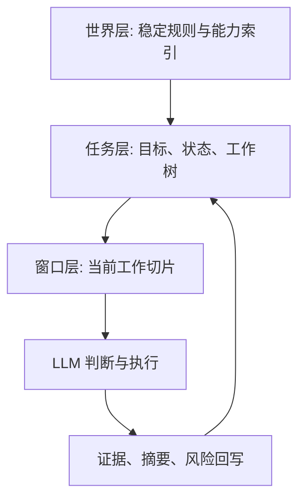

# 世界树计划运行原理（新人版）

## 1. 这套系统要解决什么问题

世界树计划不是一次性问答系统，而是长期任务系统。

它要解决的核心问题是：

1. 任务可能跨很多轮，甚至跨会话，系统仍要保持连续推进。
2. 任务不仅要给答案，还要给可审计的证据、状态和可恢复线索。
3. 模型上下文会变脏、变长、变碎，系统需要帮助 LLM 管理上下文，而不是替 LLM 做语义决策。

因此，这个系统的重点不是“单次回答多聪明”，而是“多轮执行是否稳定、可恢复、证据充分、上下文干净”。

## 2. 设计总览：三层状态 + 上下文卫生

世界树计划把 Agent 的工作拆成三层：

1. 世界层：稳定身份、边界、能力索引、行为宪法。
2. 任务层：当前任务的目标、约束、工作树、进度状态。
3. 窗口层：当前一轮真正送给模型的工作切片和摘要。

工作树属于任务层。它不是每个任务都必须使用的流程仪式，而是 LLM 的上下文卫生工具。

## 3. 工作树什么时候该用

简单、单步、上下文干净的任务可以直接完成。

工作树适合这些情况：

1. 某段工作会产生大量搜索记录、日志、中间草稿或失败尝试。
2. 任务有多个方面都要完成，例如 docs、runtime、tests、release。
3. 任务存在多个候选方向，需要隔离比较。
4. 任务包含大量重复项，例如逐文件审查、逐事件核对。
5. 当前目标不清，需要先做探索并把无效猜测隔离出去。

子节点的价值不是“让流程更像计划”，而是让父节点保持干净。子节点回到父节点时，只带回：

1. 结论。
2. 证据。
3. 已废弃路线。
4. 剩余风险。
5. 建议下一步。

完整搜索过程、完整日志、未采用草稿和失败命令流水账不应回灌父节点。

## 4. 什么仍是硬边界

新口径不是让模型自由乱跑。硬边界仍然存在：

1. 安全、预算、不可逆操作、真实付费调用和对外发布动作需要明确边界或确认。
2. `dependsOn` 表示硬依赖；前置证据缺失时不能假装完成。
3. 证据不足必须明说，不能补空白。
4. 长期有价值的新知、失败原因和关键约束应写入记忆或正式工件。

相对地，`runtime_hints`、`relationIds`、ready-set 和 delivery readiness 大多是提示或信息线索，不替 LLM 决定语义顺序。

## 5. 多窗口续跑

窗口只是临时工作区，不是最终记忆体。

持续状态来自：

1. 任务目标和当前焦点。
2. 工作树当前节点和必要摘要。
3. 记忆树、证据引用和正式工件。
4. durable snapshot 与恢复提示。

续跑时应接续当前现场；如果当前节点已经变成噪声源或过宽，再创建更小的节点隔离，而不是每轮都重新讲一遍完整历史。

## 6. 评测关注什么

评测不应再把“每个任务先建树”或旧式父节点编排路线当作通用质量标准。

当前评测应关注：

1. 是否按任务需要直接完成或按需隔离上下文。
2. 是否有真实证据、工具事实或可复查工件。
3. 子节点是否只回传父节点需要的摘要。
4. 废弃路线是否明确标记，避免后续 Agent 复用旧假设。
5. 安全、预算、不可逆动作和发布边界是否被遵守。

## 7. 新人阅读顺序

1. `docs/development/LLM_WORK_TREE_USAGE_GUIDE_AND_CASES_2026_06_28.md`
2. `docs/development/LLM_LONG_HORIZON_OVERDESIGN_AUDIT_2026_06_27.md`
3. `docs/development/ROLLING_FRONTIER_WORK_TREE_RESOLUTION_2026_06_27.md`
4. `docs/specs/work-tree-protocol-v0.2.md`
5. `docs/specs/agent-runtime-protocol-v0.2.md`

## 8. 一页总结

世界树计划的核心不是强迫模型走固定流程，而是让长期任务在多轮、可恢复、可审计的条件下持续推进。

当前四个支点是：

1. 世界层提供稳定能力和边界。
2. 任务层保存目标、状态和必要工作树。
3. 工作树按需隔离噪声，让父节点保持干净。
4. 证据、摘要、记忆和工件支撑跨窗口恢复。
