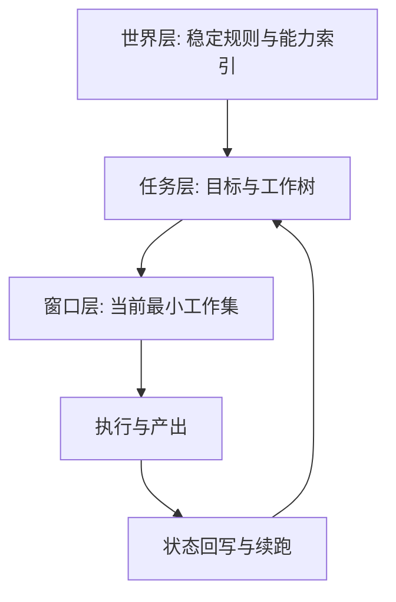

# 世界树计划运行原理（新人版）

## 1. 这套系统要解决什么问题

世界树计划不是一次性问答系统，而是一个长期任务系统。

它要解决的核心问题是：

1. 任务可能跨很多轮，甚至跨会话，系统仍要保持连续推进。
2. 任务不仅要给答案，还要给可审计的过程与可复查的证据。
3. 任务推进需要稳定编排，不因为窗口切换或模型波动而失控。

因此，这个系统的重点不是“单次回答多聪明”，而是“多轮执行是否稳定、可恢复、可交付”。

## 2. 设计总览：三层记忆 + 一条执行主线

世界树计划把 Agent 的工作拆成三层：

1. 世界层：稳定身份、边界、能力索引、行为宪法。
2. 任务层：当前任务的目标、约束、工作树、进度状态。
3. 窗口层：当前一轮真正送给模型的最小工作集。

这三层共同组成一条执行主线：

1. 先建立稳定世界。
2. 再加载任务现场。
3. 再在任务工作树上持续推进。
4. 每次输出都回写到任务状态，直到进入审批收口。

## 3. 运行阶段（只看设计，不看代码）

### 3.1 世界构建与初次苏醒

目标：让 Agent 在开始任何具体任务前，先有稳定“自我”和稳定“规则”。

这一阶段的设计原则：

1. 只加载长期稳定信息，不加载具体任务细节。
2. 优先让 Agent知道“能做什么、不能做什么”。
3. 把工具和知识当作可索引能力，而不是临时拼接文本。

### 3.2 任务启动与现场读取

目标：把某个具体任务的目标、约束和现状挂载到运行现场。

这一阶段的设计原则：

1. 任务信息独立于世界信息，避免污染长期层。
2. 任务启动必须带当前焦点与目标，不允许无目标游走。
3. 若有历史进度，必须先恢复进度，再继续执行。

### 3.3 工作树编排执行

目标：用工作树保证任务推进有结构，而不是自由发散。

当前目标口径是父节点强编排：

1. 子节点完成后，先回父节点。
2. 子节点失败后，也先回父节点。
3. 由父节点决定下一步是进入兄弟节点、继续拆分，还是汇总交付。

这让系统始终保持“先编排、后执行”的纪律，避免任务在局部节点无限漂移。

### 3.4 多窗口续跑

目标：当上下文窗口不足时，任务仍能连续推进。

核心思想：

1. 窗口只是临时工作区，不是最终记忆体。
2. 真正持续的状态在任务层和记忆层，不在单次窗口里。
3. 每次续跑都要对齐当前工作节点，不能变成 root-only 重启。

### 3.5 交付与审批收口

目标：把“执行中状态”转为“可确认交付”。

收口流程是：

1. 任务先进入 awaiting-approval。
2. 由控制面做 approve 或 revision。
3. 批准才进入 completed，修订则重新打开执行链。

这保证了“产出完成”和“交付被确认”是两件不同的事。

## 4. 为什么要坚持父节点强编排

父节点强编排不是风格偏好，而是稳定性机制。

它的作用是：

1. 防止子节点各自扩张导致全局目标漂移。
2. 防止模型在局部成功后直接宣告整任务成功。
3. 让失败可以上浮到统一决策层，而不是在叶子节点卡死。

一句话：把决策权固定在父节点，能显著降低长任务失控概率。

## 5. 评测为什么与运行设计深度绑定

世界树计划把评测当成运行设计的一部分，而不是上线后的附加动作。

评测关注的不是“答得像不像”，而是“推进是否符合设计契约”：

1. 是否按工作树推进。
2. 是否能跨窗口稳定续跑。
3. 是否在收口前满足交付结构。
4. 是否在审批后才真正完成。

因此，评测在这里本质上是运行语义的验收层。

## 6. 新人最容易混淆的三组概念

### 6.1 世界层 vs 任务层

1. 世界层是长期稳定规则。
2. 任务层是本次任务现场。

不要把任务细节放进世界层，否则长期记忆会被短期目标污染。

### 6.2 工作树节点完成 vs 任务完成

1. 节点完成只代表局部目标达成。
2. 任务完成必须经过父节点汇总与审批确认。

不要把子节点完成等同于整任务完成。

### 6.3 窗口切换 vs 任务重启

1. 窗口切换是同一任务的连续执行。
2. 任务重启是重新建立执行链。

窗口续跑必须保持节点连续性，不能每次都回到无状态起点。

## 7. 新人理解路线（建议 30 分钟）

1. 先读本页，理解三层结构和执行主线。
2. 再读工作树目标文档，确认父节点强编排语义。
3. 再看运行时协议，理解世界层、任务层、窗口层的契约边界。
4. 最后再看评测入口，理解为什么评测是运行语义的一部分。

建议阅读顺序：

1. `docs/development/WORLD_TREE_AGENT_WORKFLOW_CURRENT_VS_TARGET_2026_05_26.md`
2. `docs/specs/agent-runtime-protocol-v0.2.md`
3. `docs/specs/work-tree-protocol-v0.2.md`
4. `docs/development/REAL_TASK_TEST_CONVENTIONS_AND_WORK_TREE_BACKLOG_2026_05_25.md`

## 8. 一页总结

世界树计划的核心不是“让模型一次答对”，而是让任务在长期、多轮、可恢复、可审计的条件下仍能稳定交付。

实现这件事靠四个设计支点：

1. 世界层稳定约束。
2. 任务层结构化状态。
3. 父节点强编排的工作树推进。
4. 审批门控的交付收口。

只要新人抓住这四点，就能快速理解后续所有模块和流程设计。