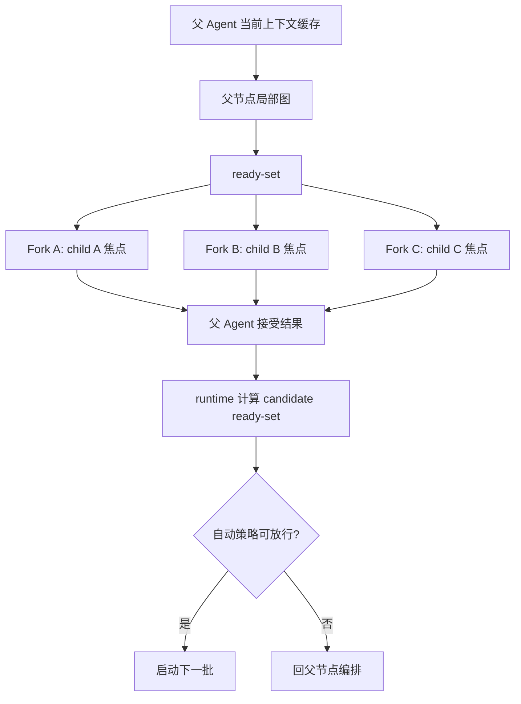

# 工作树图与 Fork 并行协议 v0.1

- 文档状态：Candidate
- 日期：2026-06-21
- 适用范围：工作树图能力、父节点局部 ready-set、Agent Fork 自我分裂并行
- 非适用范围：多线程冲突处理、跨任务全局调度器、完整实现计划

## 1. 设计结论

工作树仍然是任务执行的唯一真源。图能力不是第二套任务系统，而是从现有工作树节点、控制流边、信息流边中投影出一个父节点局部执行图，用来回答“当前父节点下面哪些 child 可以开始，哪些 child 可以并行”。

Fork 仍然是 Agent 自我分裂，不是 Sub-Agent。Fork 必须直接继承父 Agent 当前上下文缓存快照，保留父 Agent 已经形成的判断倾向、工作记忆、用户偏好和推进惯性。每个 Fork 子体只额外绑定一个工作树 child 作为执行焦点。child 节点不是替代上下文，而是告诉同一份父上下文应该沿哪条局部分支继续展开。

第一版核心公式：

```text
父 Agent 上下文缓存快照
    + child A 执行焦点 -> Fork A
    + child B 执行焦点 -> Fork B
    + child C 执行焦点 -> Fork C
```

这与 Sub-Agent 的区别必须写死：

```text
Sub-Agent = 任务说明 + 必要资料 + 低权限异步委派
Fork     = 父 Agent 当前上下文缓存 + child 执行焦点 + 同构并行推进
```

因此，Fork 的优势不是“少给上下文”，而是复用父 Agent 已经付过成本形成的上下文和判断，在多个可并行 sibling 上稳定加速。

## 2. 设计目标

第一版目标：

1. 让 `dependsOn` 成为可计算的控制流阻塞边。
2. 让 `relationIds` 成为可计算的信息流引导边。
3. 让父节点能从局部子图得到 ready-set。
4. 让 ready-set 能稳定触发 Fork 并行。
5. 让 Fork 直接复用父上下文缓存，避免额外压缩、摘要损失和重复读取。
6. 让 child 完成后回父 Agent 合并，而不是自动跳 sibling。
7. 让上下层图能传递控制流约束和信息流材料，同时保留 `dependsOn`、ready-set 和摘要回收的明确边界。

第一版非目标：

1. 不做全局最优调度器。
2. 不做跨任务抢占式调度。
3. 不做多线程冲突处理合同。
4. 不重新定义工作树 v0.2 的基础节点 schema。
5. 不把 Fork 降级成只拿任务包的 Sub-Agent。
6. 不为了兼容旧 sibling continuation 保留过渡路径。
7. 不把完整内部执行过程无条件上浮到父节点。

## 3. 工作树图能力

工作树图能力只在当前父节点局部生效。父 Agent 拆出 child 后，调度器读取这些 child 的状态、`dependsOn`、`relationIds`、`priority` 和当前执行占用情况，生成局部 ready-set 和 blocked-set。

调度器只做计算，不做最终编排。它可以说明哪些 child 可执行、为什么阻塞、哪些关系适合并行，但是否启动 Fork、是否串行降级、是否等待更多信息，仍由父 Agent 决定。

### 3.1 控制流边

控制流边写入 `dependsOn`。它表达执行资格：

- A 依赖 B，表示 B 未完成时 A 不能进入 ready-set。
- A 依赖 B，不表示 A 必须继承 B 的所有上下文。
- 控制流边是硬约束，不能被 Fork 子体绕开。
- 父 Agent 可以显式豁免或重写控制流边，但这必须成为新的父节点图决策。

控制流边用于回答“能不能开始”，不用于回答“应该优先读什么”。

### 3.2 信息流边

信息流边写入 `relationIds`。它表达认知材料和注意力引导：

- A 与 B 信息相关，表示 A 执行时应优先关注 B 的摘要、证据、文件引用或结论。
- 信息流边不阻塞 ready-set。
- 信息流边不自动变成执行顺序。
- 信息流边可以影响检索排序、提示词重点和复用证据清单。

信息流边用于回答“应该带着哪些认知材料做”，不用于回答“能不能开始”。

### 3.3 ready-set

ready-set 只在同一父节点下计算。一个 child 进入 ready-set 必须满足：

- child 仍需要执行；
- child 的 `dependsOn` 已完成、已取消或被父 Agent 显式豁免；
- child 没有等待人工确认、预算确认或上层重写；
- child 的执行焦点足够明确；
- child 没有被当前父节点标记为必须串行。

`priority` 只在同一个父节点的 ready-set 内排序。它不是全局优先级，也不能让一个节点越过未满足的 `dependsOn`。

### 3.4 父节点局部优先图

局部优先图不是全局 DAG。它只覆盖当前父节点的直接 child，以及必要时为解释阻塞而引用的直接上游节点。

这样设计有两个原因：

1. 父 Agent 保留语义编排权，避免 runtime 变成不可解释的全局调度器。
2. Fork 并行只需要 sibling 级可执行性，不需要一次性解决整个任务树的全局最优路径。

如果下层执行发现上层图缺少边，它只能提出边变更建议。正式修改上层图必须回到父 Agent。

## 4. Fork 并行能力

Fork 用于同级同构并行需求。它不是对任意任务的并发加速，而是对已经由父 Agent 拆好的 sibling child 进行自我分裂执行。

### 4.1 Fork 触发条件

父 Agent 可以在以下条件同时满足时触发 Fork：

- ready-set 中至少有两个 child。
- child 属于同一父节点。
- child 的任务形态同构或足够相似。
- child 的执行焦点已经由工作树节点表达清楚。
- child 之间没有未满足的控制流依赖。
- 父 Agent 有足够的合并预算。
- 当前父上下文缓存可作为稳定分裂锚点。
- 当前活跃 Fork 数没有超过 `maxForks` 上限。

如果这些条件不满足，应当串行推进、继续拆树、等待上游结果，或使用 Sub-Agent 做低权限异步任务。

### 4.1.1 递归 Fork 与同时运行上限

Fork 子体可以继续 Fork。递归 Fork 的语义是：一个 Fork 子体在自己的 assigned child 下继续拆出下层同级 child，并基于自己的运行视图再次自我分裂。

递归 Fork 必须满足以下规则：

- 下层 Fork 仍然属于同一个 fork tree。
- 下层 Fork 必须继承最初的 `forkRootRunId`。
- 下层 Fork 的 `parentRunId` 指向直接触发它的上一级 Fork run。
- 下层 Fork 的 `forkDepth` 必须递增。
- 下层 Fork 仍然绑定自己的 assigned child 焦点。
- 下层 Fork 不能绕过同一任务 / fork tree 的同时运行上限。

第一版只定义一个 Fork 上限：

```text
maxForks = 同一时刻允许 running / mounting / waiting-tool 的 Fork run 最大数量
```

`maxForks` 是同时运行上限，不是累计创建上限。runtime 必须按当前活跃 Fork run 计数，而不是只靠 prompt 约束。如果未来需要限制历史创建次数，应另行定义 `maxForkTotal`，不属于第一版默认合同。

示例：

```text
maxForks=3
root Fork A/B -> 当前活跃 2
Fork A 再 Fork A1/A2 -> 只能先启动 A1，当前活跃 3
A1 或 B 完成后 -> 才能继续启动 A2
```

如果活跃 Fork 数已经达到 `maxForks`，Fork 子体不能继续启动新的 Fork。它可以等待槽位、串行处理自己的下层 ready-set，或回父节点请求策略调整。

### 4.2 上下文继承

Fork 的上下文继承原则是：直接继承父 Agent 当前上下文缓存快照，不做额外压缩，不重新生成独立上下文包。

父上下文缓存快照至少语义包含：

- 父 Agent 当前目标和父节点意图；
- 最近工作记忆和关键判断；
- 用户偏好与本仓库约束；
- 当前工作树位置与 active path；
- 已知事实、排除方向和风险；
- 当前提示词中与任务相关的运行时规则；
- 已经进入上下文窗口的证据、摘要和最近工具结果。

Fork 子体额外接收的是 child 执行焦点，而不是替代上下文。这个焦点来自工作树 child 本身，包括 child 目标、验收标准、`dependsOn`、`relationIds`、优先级和预期产物。

因此，Fork 启动时的语义是：

```text
继续使用父 Agent 刚才的上下文和判断，但当前执行位置切到 child X。
```

### 4.3 缓存继承与 provider cache

这里的“父上下文缓存”是运行时语义，不等同于 provider 返回的 cache hit 指标。

实现时必须区分：

- runtime 是否能证明 Fork 基于同一个父上下文锚点分裂；
- provider 是否命中底层 prefix cache；
- Fork 子体的当前 child 焦点是否正确注入；
- `currentNodeId`、`topFrameId`、active path 是否与 child 焦点一致。

provider cache hit 可以降低成本，但不能单独证明 Fork 语义成立。反过来，provider 没有命中缓存时，只要 runtime 仍用同一父上下文锚点重建了上下文，Fork 语义仍然成立，只是成本更高。

第一版不应该为了省成本而强制压缩父上下文。若上下文无法完整重建或超过模型窗口，应优先串行降级、选择更大上下文模型，或请求预算调整。自动摘要压缩只能作为后续专门设计，不属于 Fork v0.1 的默认路径。

### 4.4 执行焦点

Fork 子体必须以自己的 child node 作为当前执行焦点。它继承父 Agent 的共同认知，但不能继续以父节点作为当前工作节点执行。

执行焦点必须明确回答：

- 我负责哪个 child。
- 这个 child 的目标是什么。
- 这个 child 的完成标准是什么。
- 哪些 `dependsOn` 已满足。
- 哪些 `relationIds` 是优先关注材料。
- 产出应回写到哪个 child。

如果 child 焦点不明确，不允许 Fork。父 Agent 应先补清节点目标或继续拆分。

### 4.5 合并回父 Agent

Fork 子体完成后必须回父 Agent 合并。父 Agent 读取 child 的结果摘要、证据引用、缺口、风险和建议关系，再重新计算父节点 ready-set。

Fork 子体不得自动进入 sibling，也不得把自己的局部判断直接改写为父节点最终结论。它可以提出建议，但父 Agent 负责接受、拒绝或重排。

这样可以保持两个性质：

- 并行执行加速局部工作；
- 父节点仍是唯一语义编排者。

## 5. 上下层图的边传递

上下层图传递的是语义约束，不是简单复制全部边。

### 5.1 控制流边向下传递

上层控制流边向下传递时，变成下层的硬约束边界。

如果父节点下的 B 依赖 A，那么 B 被 Fork 后，无论 B 内部怎么拆子图，都不能绕开“A 尚未完成”这个上层事实。B 的下层图可以把自己的内部执行继续拆成 B1、B2、B3，但只能在上层依赖满足之后启动。

下层可以细化控制流边，不能静默取消上层控制流边。

### 5.2 控制流边向上传递

下层控制流边向上传递时，默认压缩成节点状态，而不是把每一个内部步骤暴露到上层图。

父 Agent 只需要知道：

- child 是否完成；
- child 是否阻塞；
- child 是否失败；
- child 是否需要父节点决策；
- child 是否发现了新的上层依赖。

只有当下层发现“原上层依赖设计不完整”时，才提出新的控制流边建议。该建议必须由父 Agent 接受后才能写入上层图。

### 5.3 信息流边向下传递

上层信息流边向下传递时，变成 Fork 子体的注意力和检索优先级。

在直接继承父上下文缓存的设计下，信息流边不是为了裁剪上下文，而是为了告诉 Fork：

- 哪些兄弟节点或上游节点的产物最相关；
- 哪些证据先读；
- 哪些文件、记忆节点或摘要应排在检索前面；
- 哪些结论可以复用，避免重复查找。

Fork 仍然继承完整父上下文，但 `relationIds` 决定它在当前 child 焦点下先看什么。

如果信息流目标的下层 child 尚未创建，不应提前强行创建接收节点，也不应把信息全文塞入目标父节点 prompt。第一版采用延迟信息流传递：

1. 信息先挂到目标父节点的 pending 信息流索引。
2. 每条索引只保存摘要、归类、来源节点、关系类型、原文或证据引用、建议接收范围和消费状态。
3. 目标父节点后续展开 child 时，新 child 先看到这些摘要和归类。
4. child 根据自己的执行焦点决定是否读取原文或证据。
5. 已消费的信息标记 consumed；不相关的信息保留在父节点索引中，不主动注入所有 child。

这里不引入 hot / warm / cold 三层上下文。第一版只要求“摘要 + 归类 + 原文引用”：摘要负责快速判断，归类负责路由，原文引用负责按需追溯。

### 5.4 信息流边向上传递

下层信息流边向上传递时，默认压缩为证据、摘要和关系建议。

Fork 子体不应该把完整内部过程全部灌回父节点，而应上浮：

- 可复用证据；
- 可复用结论摘要；
- 新发现的关联；
- 反例或风险；
- 对 sibling 有帮助的材料；
- 仍缺失的信息。

父 Agent 决定哪些信息成为正式 `relationIds`，哪些只保留在 child 摘要中，哪些需要触发后续任务。

当上浮信息的目标 child 已存在时，可以直接成为目标 child 的信息流输入；当目标 child 尚未存在时，必须先进入目标父节点的 pending 信息流索引，等待该父节点展开后再分发。父节点只保存摘要、归类和原文引用，不保存大段正文。

## 6. 调度流程

第一版流程如下：

1. 父 Agent 读取当前父节点上下文。
2. 父 Agent 拆出多个 child，并写清目标、依赖、信息关系和优先级。
3. 调度器从当前父节点 child 投影局部执行图。
4. 调度器计算 ready-set 和 blocked-set。
5. 父 Agent 检查 ready-set 是否适合 Fork。
6. 若适合，runtime 以父上下文缓存快照为锚点启动多个 Fork。
7. 每个 Fork 继承同一父上下文缓存，并注入不同 child 执行焦点。
8. 每个 Fork 只推进自己的 child。
9. child 结果回到父 Agent。
10. 父 Agent 接受 child 摘要、证据和 pending 信息流索引更新。
11. runtime 基于更新后的工作树状态确定性计算 candidate ready-set。
12. 自动策略或父 Agent 门禁决定是否启动下一批。

ready-set 必须由程序计算，而不是由 LLM 手工推理。父 Agent 的职责是语义编排：接受或拒绝 child 结果、决定是否改图、决定是否放行下一批。程序的职责是根据 `dependsOn`、节点状态、执行占用、手动门禁和优先级计算 candidate ready-set。

第 n+1 批可以自动启动的条件：

- 第 n+1 批 child 已存在且执行焦点明确。
- 所有控制流依赖已满足。
- 第 n 批没有产生 plan-changing finding。
- 第 n 批结果质量达标，没有要求父节点决策。
- pending 信息流只改变注意力和检索优先级，不改变下游任务形态。
- 预算、并行度和模型选择仍在父节点预设范围内。

必须回父节点编排的条件：

- 第 n 批发现原计划错误或需要新增、删除、拆分、合并 child。
- 出现新的控制流依赖或原有 `dependsOn` 需要重写。
- 第 n+1 批尚未创建，且创建方式依赖第 n 批结果。
- 子节点结果互相冲突或质量不足。
- 下游节点需要根据新信息改变任务焦点。
- 预算不足，需要父 Agent 选择下一批优先级。
- 下一步是设计判断、交付判断或路线判断，而不是预声明流水线。

用 Mermaid 表达：



## 7. 与现有协议的关系

本规格建立在 `work-tree-protocol-v0.2.md` 和 `agent-runtime-protocol-v0.2.md` 之上。

需要保持的现有口径：

- 工作树节点仍使用 `dependsOn` 表达控制流依赖。
- 工作树节点仍使用 `relationIds` 表达信息流关联。
- Fork 前必须先创建多个平行工作树子节点。
- Fork 是同构 Agent 上下文分裂，不是普通 Sub-Agent。
- Fork 预算必须保留父 Agent 合并预算。
- child 完成后先回父节点编排，而不是直接自动跳到 sibling。
- 不做自动全局最优任务调度器。

本规格对上一轮设计盘点做出的纠偏：

- Fork 不应被描述为“禁止携带完整父上下文”。
- Fork 应直接继承父 Agent 当前上下文缓存快照。
- child 焦点用于引导执行，而不是替代父上下文。
- 信息流边用于注意力和检索优先级，不用于裁剪父上下文。

## 8. 潜在问题与检测点

### 8.1 Fork 子体继承过多上下文后偏离 child 焦点

问题：Fork 拿到完整父上下文后，可能继续思考父节点全局问题，而不是处理 assigned child。

检测点：

- Fork 输出是否明确绑定 assigned child。
- 输出是否修改了父节点目标。
- 输出是否尝试进入 sibling。
- 工具调用是否带正确 source work-tree node。

缓解：

- child 焦点必须在 Fork 入口处显式注入。
- Prompt 中必须强调“继承父上下文，但当前只执行 child X”。
- 输出必须回写 child 摘要和证据，不直接交付整任务。

### 8.2 provider cache hit 被误解为 Fork 语义成立

问题：底层模型命中缓存，不等于 runtime 的工作树位置、父上下文锚点和 child 焦点正确。

检测点：

- parent context anchor 是否一致。
- Fork 启动时的 active path 是否一致。
- child current focus 是否正确。
- provider cache 指标是否只作为成本指标记录。

缓解：

- runtime 记录自己的上下文锚点和 child 焦点校验。
- 不把 provider cache hit 当成唯一验收条件。

### 8.3 currentNodeId 被误解为 task-global 单例

问题：并行 Fork 会同时存在多个 active child。如果实现把 `WorkTreeProtocol.currentNodeId` 当成整个 task 的单例可变字段，多个 Fork 会互相覆盖执行指针，破坏 `currentNodeId`、`topFrameId` 和 active path 的一致性。

检测点：

- 父 Agent 运行窗口的当前节点是否仍是编排父节点。
- Fork A / Fork B 的窗口工件内是否分别指向自己的 child。
- 每个 AgentRun 内 `currentNodeId` 与 `topFrame.nodeId` 是否一致。
- task 级工作树是否避免被多个 Fork 直接改写同一个全局当前指针。

缓解：

- `currentNodeId` 一致性约束应落在每个 AgentRun / 每个窗口工件内。
- 父任务级工作树保存节点状态和拓扑，Fork 子体的当前执行指针保存在各自运行视图中。
- child 完成后由父 Agent 合并状态，再决定 task 级当前指针如何推进。

### 8.4 信息流边被错误当作控制流边

问题：把 `relationIds` 当成阻塞依赖会降低并行度；把 `dependsOn` 当成信息关联会导致过早并行。

检测点：

- 有信息流关系但无控制依赖的 sibling 是否仍可同时进入 ready-set。
- 有控制依赖的节点是否不会因为高优先级而越过依赖。

缓解：

- ready-set 只看控制流和执行资格。
- relationIds 只影响注意力、检索和复用证据。

### 8.5 下层图静默改写上层图

问题：Fork 子体发现新依赖后直接重写上层图，会破坏上层 `dependsOn` 真源和父 Agent 的合并边界。

检测点：

- child 是否只提交依赖建议。
- 父 Agent 是否显式接受后才改变上层边。

缓解：

- 下层向上传递控制流变化时默认是 proposal。
- 父 Agent 负责确认、拒绝或重排。

### 8.6 信息流上浮造成上下文膨胀

问题：多个 Fork 把完整过程都上浮，父 Agent 合并时上下文膨胀，反而抵消并行收益。

检测点：

- child 上浮内容是否以摘要、归类、原文或证据引用、关系建议为主。
- 父 Agent 是否只读取必要细节。
- 目标 child 尚未创建时，信息是否进入目标父节点 pending 信息流索引，而不是直接进入 prompt。

缓解：

- child 不上浮完整内部过程。
- 每条 pending 信息流记录只保存摘要、归类和原文引用，不直接复制长文本。
- 父 Agent 按 relationIds 决定给 sibling 传哪些材料。
- 下游 child 看到摘要和归类后，按自己的执行焦点决定是否读取原文。

### 8.7 ready-set 局部性被扩大成全局调度

问题：实现时容易把所有任务节点放进一个全局队列，导致父 Agent 编排权被绕过。

检测点：

- ready-set 是否始终带 parent node 作用域。
- priority 是否只在同一父节点下排序。
- child 完成后是否回父 Agent，而不是 runtime 自动拿全局下一个节点。

缓解：

- 第一版只实现父节点局部 ready-set。
- 全局任务队列只承载执行，不决定语义顺序。

### 8.8 Fork 过度启动导致父 Agent 无法合并

问题：ready-set 很大时全部 Fork，会消耗预算并让合并成本过高。

检测点：

- 父 Agent 是否保留合并预算。
- Fork 数是否受模型、预算、上下文窗口和父节点复杂度限制。
- 并行结果是否能在一次父节点合并中处理。

缓解：

- Fork 是父 Agent 的显式决定。
- 可以分批 Fork。
- 合并预算不足时串行或缩小 ready-set。

## 9. 第一版验收场景

第一版至少要用以下场景验收设计：

1. 两个 sibling 无 `dependsOn`，均进入 ready-set，可 Fork 并行。
2. B `dependsOn` A，A 未完成时 B 不进入 ready-set。
3. B 与 A 只有 `relationIds`，没有 `dependsOn`，B 不被阻塞，但优先继承 A 的证据和摘要作为注意力材料。
4. Fork A / Fork B 使用同一父上下文缓存锚点，但各自绑定不同 child 焦点。
5. Fork 子体输出不直接交付整任务，只回写自己的 child 摘要、证据和缺口。
6. child 完成后父 Agent 重新计算 ready-set。
7. 下层发现新控制依赖时，只提出建议，由父 Agent 接受后写入上层图。
8. relationIds 上浮时只作为信息流建议，不自动变成 dependsOn。
9. provider cache hit 不作为 Fork 语义成立的唯一依据。
10. ready-set 排序只在同一父节点内使用 priority。
11. 多个 Fork 并行时，每个 AgentRun / 窗口工件内的 `currentNodeId`、`topFrameId` 和 child 焦点一致，task 级工作树不会被多个 Fork 互相覆盖同一个全局当前指针。
12. A 的子节点产出与 B 相关的信息，但 B 的子节点尚未创建时，信息进入 B 的 pending 信息流索引；后续 B 展开 child 时，child 看到摘要和归类，并可按需读取原文。
13. 第 n 批结果无语义变更且第 n+1 批 child 已预声明时，runtime 自动计算并启动下一批；第 n 批结果要求改图或重排时，回父 Agent 编排。

## 10. 实施顺序建议

第一阶段只落协议与观测：

1. 让 ready-set 计算成为可单测函数。
2. 让 Fork 启动记录 parent context anchor 和 child focus。
3. 让调试工件展示 dependsOn 阻塞、relationIds 注意力和 Fork 分裂锚点。
4. 让 LLM 工作分析器能显示 child 完成后回父节点的链路。

第二阶段再接 runtime：

1. 在父节点编排处调用局部 ready-set。
2. 在 ready-set 里按父 Agent 决策启动 Fork。
3. Fork 子体复用父上下文缓存，并注入 child 焦点。
4. 子体完成后通过现有 child summary / evidence 路径回父节点。

第三阶段再补资源策略：

1. 按模型能力和上下文窗口决定 Fork 批次大小。
2. 对 cache miss、窗口不足和合并预算不足做串行降级。
3. 加入并行收益、重复读取减少率和合并成本指标。

多线程冲突处理、跨进程 lease 和数据库 fencing 不属于本规格第一版，应在后续专门冲突合同中冻结。

## 11. 实现前仍需冻结的最小合同

本规格的概念边界已经足够明确，但若要开始编码，还必须补齐以下可编码合同。否则不同实现者会在对象落点、状态语义和自动放行策略上产生分叉。

### 11.1 ready-set 计算函数合同

第一版应先实现一个纯函数，不依赖 LLM：

```text
compute_parent_ready_set(work_tree, parent_node_id, policy) -> ready-set decision
```

该函数只读取当前父节点的直接 child 和必要上游节点。第一版必须冻结：

- 可进入 ready-set 的节点状态：默认只允许 `pending`；`blocked` 只有在 blocker 已被父 Agent 或 policy 显式解除后才允许。
- 不可进入 ready-set 的节点状态：`in-progress`、`summarizing`、`completed`、`failed`、`skipped`。
- 依赖满足状态：`dependsOn` 指向节点必须是 `completed` 或被显式豁免；是否允许 `skipped` 视为满足必须由 policy 显式声明。
- blocked reason 枚举：至少包含 `dependency`、`status`、`manual-gate`、`budget`、`unclear-focus`、`already-running`、`policy`。
- 排序规则：先按 `priority` 升序，再按创建顺序或节点 id 稳定排序。

ready-set 计算不读取 `relationIds` 作为阻塞条件。`relationIds` 只输出 attention / inheritance hints。

### 11.2 自动启动门禁合同

ready-set 是候选集合，不等于必须启动。第一版需要在父节点或执行请求上冻结自动启动策略：

```text
autoLaunchPolicy = disabled | predeclared-pipeline | ready-set-safe
```

推荐默认值是 `disabled`，实现和测试成熟后再打开 `predeclared-pipeline`。

- `disabled`：只计算 candidate ready-set，回父 Agent 编排。
- `predeclared-pipeline`：只允许启动已经存在、焦点明确、依赖满足、且上一批没有 plan-changing finding 的 child。
- `ready-set-safe`：允许更积极地启动 ready-set，但仍必须满足预算、模型、并行度和人工门禁。

Fork policy 必须包含：

```text
maxForks: integer
allowRecursiveFork: boolean
```

推荐第一版默认：

```text
maxForks = 3
allowRecursiveFork = true
```

`maxForks` 是同时活跃 Fork 上限。递归 Fork 不获得新的上限；它和同一任务 / fork tree 中已有 Fork 共同竞争这组运行槽位。

child 结果必须能显式表达是否改变计划：

```text
planImpact = none | attention-only | requires-parent-replan
```

只有 `planImpact=none|attention-only` 时，自动策略才能考虑放行下一批；`requires-parent-replan` 必须回父节点。

### 11.3 pending 信息流索引合同

当前 `WorkTreeNode` 是 `extra=forbid`，实现不能随意塞新字段。因此第一版必须选择一个正式承载位置。

推荐直接在 `WorkTreeNode` 上新增：

```text
pendingInformationItems:
  - id
  - sourceNodeId
  - sourceRunId
  - relationType
  - category
  - summary
  - originalRef
  - suggestedRecipientScope
  - confidence
  - status
```

字段语义：

- `category` 用于归类，例如 `evidence`、`finding`、`risk`、`counterexample`、`todo`、`reference`。
- `summary` 是子节点直接可见的短摘要。
- `originalRef` 指向原文、证据、资产、记忆节点或工具结果，不复制正文。
- `suggestedRecipientScope` 描述未来哪些 child 可能相关，例如 `all-children`、`implementation`、`tests`、`docs`、`unknown`。
- `status` 至少包含 `pending`、`consumed`、`dismissed`、`superseded`。

如果不想扩 `WorkTreeNode`，也可以新建 `WorkTreeInformationItem` 独立对象。但无论选哪种，不能只停留在 `relationIds` 字符串列表，否则 B child 尚未创建时无法落 pending 信息。

### 11.4 relationIds 指向合同

当前节点已有 `relationIds`，但实现前必须冻结它指向什么。第一版不应让它同时指向多种对象。

推荐第一版：

```text
relationIds -> WorkTreeRelation.id
```

`WorkTreeRelation` 至少需要表达：

- source node；
- target node 或 target parent node；
- relation type；
- confidence；
- evidence refs；
- created by；
- status。

`pendingInformationItems` 解决“信息暂存和下发”，`WorkTreeRelation` 解决“图上为什么相关”。两者可以互相引用，但不要混成一个字段。

### 11.5 Fork AgentRun 合同

现有 `AgentRun.runType` 只有 `main | subagent | maintenance | evaluation`。实现 Fork 前必须新增 `fork`，否则会被误实现为 `subagent` 或普通 `main`。

第一版需要冻结：

- `runType=fork`。
- `parentRunId` 指向触发 Fork 的父 Agent run。
- `forkRootRunId` 指向本轮 fork tree 的根 Fork run；第一层 Fork 可等于自己的 run id 或同批次根标识。
- `forkDepth` 从 1 开始，递归 Fork 每深入一层加 1。
- 每个 Fork run 绑定一个 `assignedWorkTreeNodeId`。
- 每个 Fork run 记录同一个 `parentContextAnchor`。
- 每个 Fork run 的窗口工件内 `currentNodeId/topFrameId` 指向自己的 child。
- runtime 必须能按 `forkRootRunId` 统计已创建 Fork 总数和活跃 Fork 数。

Fork 不创建独立子任务，也不创建 Sub-Agent 分支。它是同一任务内的并行 AgentRun 视图；是否将来允许跨分支 Fork，另行设计。

### 11.6 父上下文锚点合同

Fork 继承父上下文缓存，必须有可验收的 runtime 锚点，而不是只写在提示词里。

第一版至少记录：

- parent task id；
- parent run id；
- parent invocation id 或 prompt compile artifact id；
- parent work-context stack digest；
- parent current node id；
- active path node ids；
- prefix cache key 或 runtime context digest；
- generated at。

该锚点用于证明多个 Fork 从同一父上下文分裂。provider cache hit 只作为性能指标，不作为语义证明。

### 11.7 Fork 启动载荷合同

Fork 启动载荷至少要包含：

- `parentTaskId`
- `parentRunId`
- `forkRootRunId`
- `forkBatchId`
- `forkRunId`
- `forkDepth`
- `assignedWorkTreeNodeId`
- `parentContextAnchor`
- `readySetDecisionId`
- `autoLaunchPolicy`
- `maxForks`
- `activeForkCount`
- `availableForkSlots`
- `attentionRelationIds`
- `pendingInformationItemIds`

其中 `attentionRelationIds` 和 `pendingInformationItemIds` 只用于提示当前 child 优先看什么，不限制 Fork 读取父上下文。

### 11.8 Fork 结果合同

Fork child 完成后不能只返回自然语言摘要。第一版至少要结构化返回：

- assigned work tree node id；
- status；
- execution summary；
- produced evidence refs；
- pending information items；
- proposed relation changes；
- proposed dependency changes；
- plan impact；
- quality gate status；
- incomplete / blockers。

父 Agent 和自动策略依赖 `planImpact`、`qualityGateStatus`、`proposedDependencyChanges` 来决定是否启动下一批。

### 11.9 task 级工作树与 Fork 运行视图边界

第一版实现必须明确：

- task 级 `WorkTreeProtocol` 保存拓扑、节点状态、关系和 pending 信息流索引。
- Fork run 的 `currentNodeId` 是运行视图字段，保存在 Fork 启动载荷、窗口工件和 AgentRun 关联工件中。
- Fork run 不直接把 task 级 `WorkTreeProtocol.currentNodeId` 改成自己的 child。
- child 完成后由父 Agent 或合并器更新 task 级节点状态，再决定 task 级 current node 如何推进。

这条是并行 Fork 的硬前提。否则两个 Fork 同时运行时会互相覆盖 task-global 当前指针。

### 11.10 最小实现切片

建议第一批实现只做以下内容：

1. 在 contracts 中新增 pending 信息流条目和 relation 对象，或等价的正式承载对象。
2. 给 `AgentRun.runType` 增加 `fork`。
3. 新增 ready-set 纯函数和单测。
4. 新增父上下文锚点生成函数和单测。
5. 新增 Fork 启动载荷构造函数，但先不接真实 worker 并发。
6. 新增 Fork 结果合并函数，先用同步模拟结果驱动 ready-set 重新计算。
7. 最后再接 worker / queue 并行执行。

这样可以先验证图语义、信息流延迟传递和上下文锚点，再进入真正并行运行。

### 11.11 最小测试清单

第一批测试应覆盖：

1. `dependsOn` 未满足时不进入 ready-set。
2. 只有 `relationIds` 时不阻塞 ready-set。
3. `priority` 只在同父节点 ready-set 内排序。
4. A child 给尚未展开的 B child 传信息时，信息落到 B 的 pending 信息流索引。
5. B 展开 child 后，child 能看到摘要和归类，并按需读取 original ref。
6. `planImpact=none` 且 pipeline 预声明时自动进入下一批。
7. `planImpact=requires-parent-replan` 时回父节点编排。
8. 两个 Fork run 共享同一 parent context anchor。
9. 两个 Fork run 的运行视图分别指向自己的 child，不覆盖 task 级 current node。
10. Fork 结果只通过结构化结果合并，不直接把 sibling 变成当前节点。
11. Fork 子体可以继续 Fork，但递归 Fork 必须继承同一个 `forkRootRunId`，并受同一个 `maxForks` 同时活跃上限约束。
12. 当活跃 Fork 数已达到 `maxForks` 时，下层 ready-set 不得继续启动新 Fork，只能串行、等待槽位或回父节点请求策略调整。
